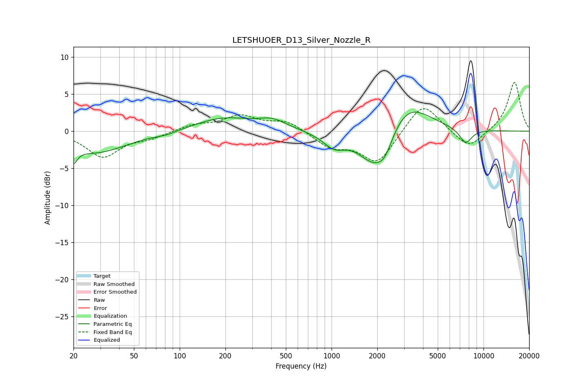

# LETSHUOER_D13_Silver_Nozzle_R
See [usage instructions](https://github.com/jaakkopasanen/AutoEq#usage) for more options and info.

### Parametric EQs
Apply preamp of -2.7 dB when using parametric equalizer.

|   # | Type    |   Fc (Hz) |    Q |   Gain (dB) |
|-----|---------|-----------|------|-------------|
|   1 | Peaking |        20 | 5.73 |        -1.9 |
|   2 | Peaking |        27 | 0.66 |        -2.9 |
|   3 | Peaking |        81 | 2.16 |        -0.3 |
|   4 | Peaking |       193 | 0.78 |         1.8 |
|   5 | Peaking |       407 | 1.49 |         1.3 |
|   6 | Peaking |      1037 | 1.93 |        -1.9 |
|   7 | Peaking |      1905 | 1.32 |        -5.1 |
|   8 | Peaking |      2247 | 2.73 |        -2.2 |
|   9 | Peaking |      3102 | 0.96 |         4.5 |
|  10 | Peaking |      7631 | 3.2  |        -2   |

### Fixed Band EQs
When using fixed band (also called graphic) equalizer, apply preamp of **-6.7 dB** (if available) and set gains manually with these parameters.

|   # | Type    |   Fc (Hz) |    Q |   Gain (dB) |
|-----|---------|-----------|------|-------------|
|   1 | Peaking |        31 | 1.41 |        -3.4 |
|   2 | Peaking |        62 | 1.41 |        -0.8 |
|   3 | Peaking |       125 | 1.41 |         0.8 |
|   4 | Peaking |       250 | 1.41 |         2   |
|   5 | Peaking |       500 | 1.41 |         1.4 |
|   6 | Peaking |      1000 | 1.41 |        -2   |
|   7 | Peaking |      2000 | 1.41 |        -4.3 |
|   8 | Peaking |      4000 | 1.41 |         4.1 |
|   9 | Peaking |      8000 | 1.41 |        -2.5 |
|  10 | Peaking |     16000 | 1.41 |         6.7 |

### Graphs

