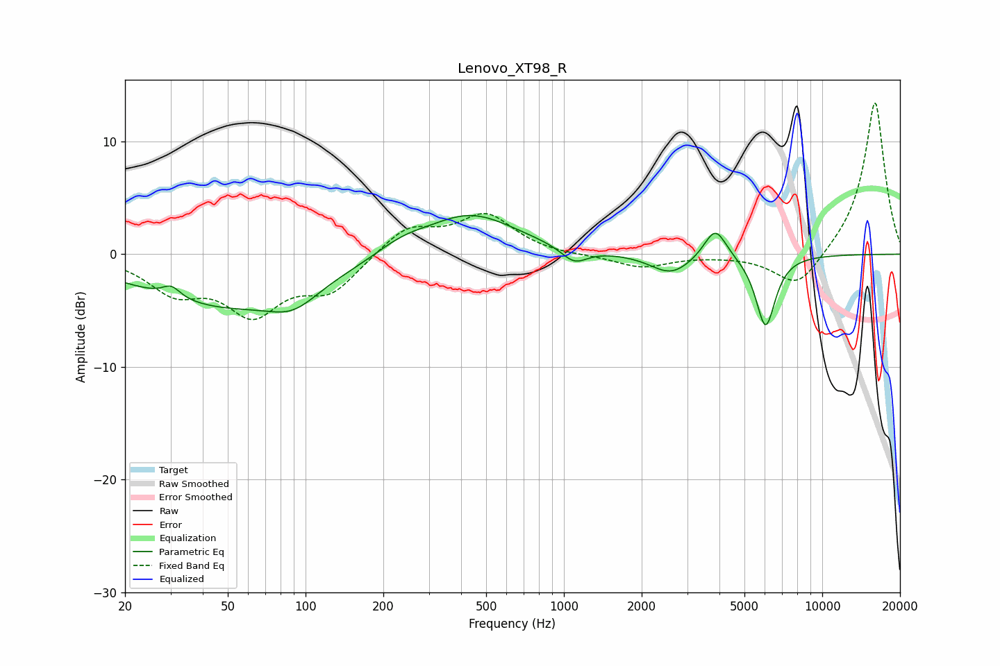

# Lenovo_XT98_R
See [usage instructions](https://github.com/jaakkopasanen/AutoEq#usage) for more options and info.

### Parametric EQs
Apply preamp of -3.5 dB when using parametric equalizer.

|   # | Type    |   Fc (Hz) |    Q |   Gain (dB) |
|-----|---------|-----------|------|-------------|
|   1 | Peaking |        30 | 4.12 |         1   |
|   2 | Peaking |        49 | 0.42 |        -4.5 |
|   3 | Peaking |        90 | 1.47 |        -1.8 |
|   4 | Peaking |       233 | 2.74 |        -0.3 |
|   5 | Peaking |       234 | 1.8  |         1.1 |
|   6 | Peaking |       430 | 0.78 |         3.7 |
|   7 | Peaking |      1097 | 2.81 |        -1.4 |
|   8 | Peaking |      2602 | 1.76 |        -1.8 |
|   9 | Peaking |      3853 | 3.22 |         2.9 |
|  10 | Peaking |      6035 | 3.62 |        -6.4 |

### Fixed Band EQs
When using fixed band (also called graphic) equalizer, apply preamp of **-13.5 dB** (if available) and set gains manually with these parameters.

|   # | Type    |   Fc (Hz) |    Q |   Gain (dB) |
|-----|---------|-----------|------|-------------|
|   1 | Peaking |        31 | 1.41 |        -3   |
|   2 | Peaking |        62 | 1.41 |        -4.8 |
|   3 | Peaking |       125 | 1.41 |        -3.1 |
|   4 | Peaking |       250 | 1.41 |         2.4 |
|   5 | Peaking |       500 | 1.41 |         3.4 |
|   6 | Peaking |      1000 | 1.41 |        -0.2 |
|   7 | Peaking |      2000 | 1.41 |        -1.2 |
|   8 | Peaking |      4000 | 1.41 |        -0.1 |
|   9 | Peaking |      8000 | 1.41 |        -3.2 |
|  10 | Peaking |     16000 | 1.41 |        13.7 |

### Graphs

