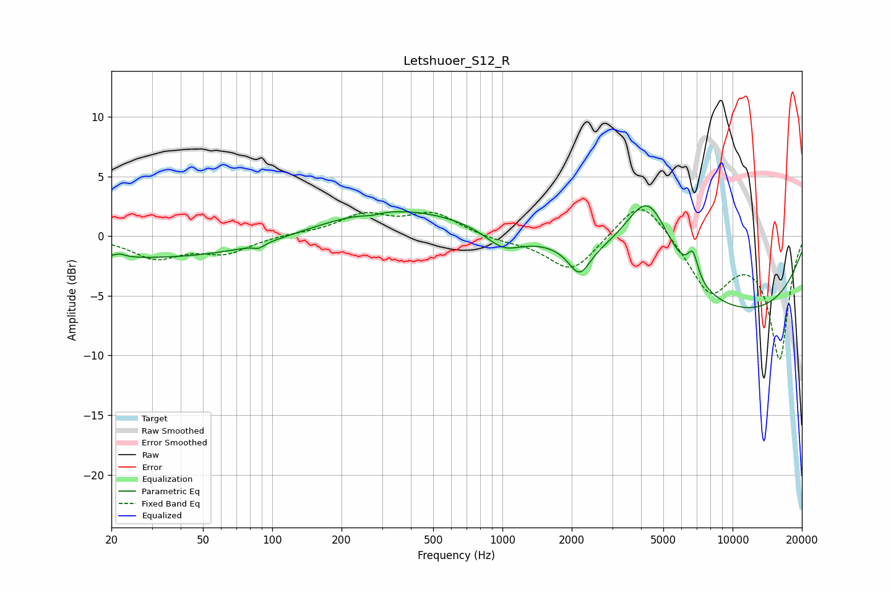

# Letshuoer_S12_R
See [usage instructions](https://github.com/jaakkopasanen/AutoEq#usage) for more options and info.

### Parametric EQs
Apply preamp of -2.6 dB when using parametric equalizer.

|   # | Type    |   Fc (Hz) |    Q |   Gain (dB) |
|-----|---------|-----------|------|-------------|
|   1 | Peaking |        22 | 5.9  |         0.3 |
|   2 | Peaking |        34 | 0.22 |        -1.9 |
|   3 | Peaking |        88 | 5.96 |        -0.4 |
|   4 | Peaking |       269 | 3.78 |        -0.2 |
|   5 | Peaking |       316 | 0.39 |         2.6 |
|   6 | Peaking |      1009 | 1.8  |        -1.5 |
|   7 | Peaking |      2164 | 2.99 |        -2.5 |
|   8 | Peaking |      4299 | 1.3  |         7.1 |
|   9 | Peaking |      6719 | 6    |         2.1 |
|  10 | Peaking |     10000 | 0.26 |        -6.6 |

### Fixed Band EQs
When using fixed band (also called graphic) equalizer, apply preamp of **-2.3 dB** (if available) and set gains manually with these parameters.

|   # | Type    |   Fc (Hz) |    Q |   Gain (dB) |
|-----|---------|-----------|------|-------------|
|   1 | Peaking |        31 | 1.41 |        -1.8 |
|   2 | Peaking |        62 | 1.41 |        -1.3 |
|   3 | Peaking |       125 | 1.41 |         0.2 |
|   4 | Peaking |       250 | 1.41 |         1.7 |
|   5 | Peaking |       500 | 1.41 |         1.8 |
|   6 | Peaking |      1000 | 1.41 |        -0.3 |
|   7 | Peaking |      2000 | 1.41 |        -3.1 |
|   8 | Peaking |      4000 | 1.41 |         3.5 |
|   9 | Peaking |      8000 | 1.41 |        -4.6 |
|  10 | Peaking |     16000 | 1.41 |       -10.2 |

### Graphs

