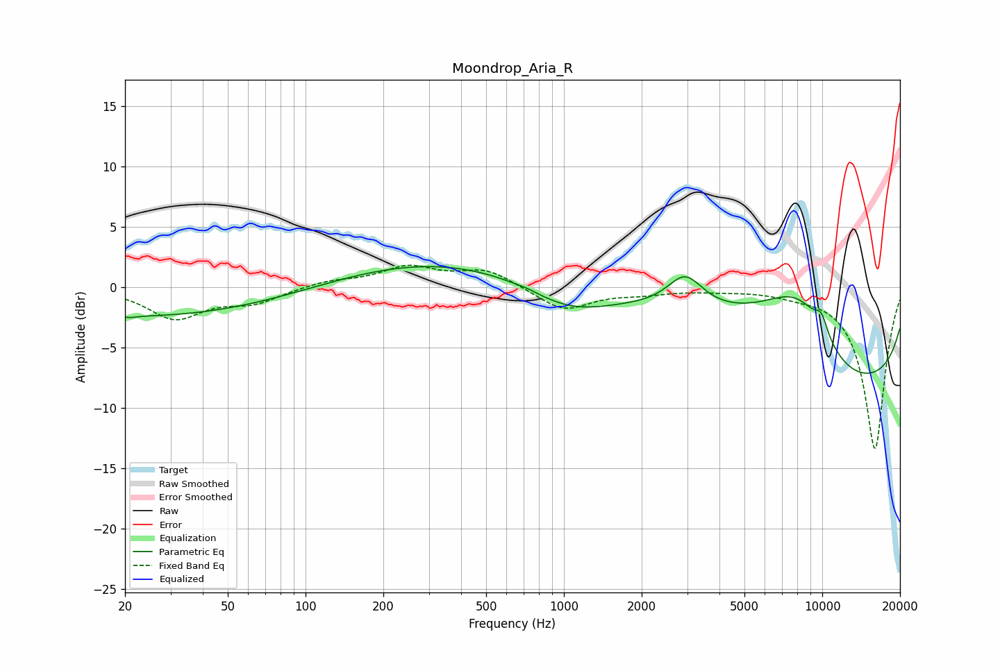

# Moondrop_Aria_R
See [usage instructions](https://github.com/jaakkopasanen/AutoEq#usage) for more options and info.

### Parametric EQs
Apply preamp of -1.8 dB when using parametric equalizer.

|   # | Type    |   Fc (Hz) |    Q |   Gain (dB) |
|-----|---------|-----------|------|-------------|
|   1 | Peaking |        21 | 4.99 |        -0.2 |
|   2 | Peaking |        32 | 0.29 |        -3.6 |
|   3 | Peaking |        82 | 0.2  |         1.5 |
|   4 | Peaking |       720 | 5.67 |         0.1 |
|   5 | Peaking |      1016 | 0.18 |         2.1 |
|   6 | Peaking |      1043 | 0.82 |        -2.4 |
|   7 | Peaking |      2946 | 2.06 |         2.8 |
|   8 | Peaking |      8285 | 0.52 |        15.9 |
|   9 | Peaking |      9908 | 0.28 |       -18.5 |
|  10 | Peaking |      9931 | 4.93 |         1.4 |

### Fixed Band EQs
When using fixed band (also called graphic) equalizer, apply preamp of **-1.9 dB** (if available) and set gains manually with these parameters.

|   # | Type    |   Fc (Hz) |    Q |   Gain (dB) |
|-----|---------|-----------|------|-------------|
|   1 | Peaking |        31 | 1.41 |        -2.5 |
|   2 | Peaking |        62 | 1.41 |        -1.2 |
|   3 | Peaking |       125 | 1.41 |         0.5 |
|   4 | Peaking |       250 | 1.41 |         1.6 |
|   5 | Peaking |       500 | 1.41 |         1.4 |
|   6 | Peaking |      1000 | 1.41 |        -1.9 |
|   7 | Peaking |      2000 | 1.41 |        -0.4 |
|   8 | Peaking |      4000 | 1.41 |        -0.2 |
|   9 | Peaking |      8000 | 1.41 |        -0.3 |
|  10 | Peaking |     16000 | 1.41 |       -13.4 |

### Graphs

