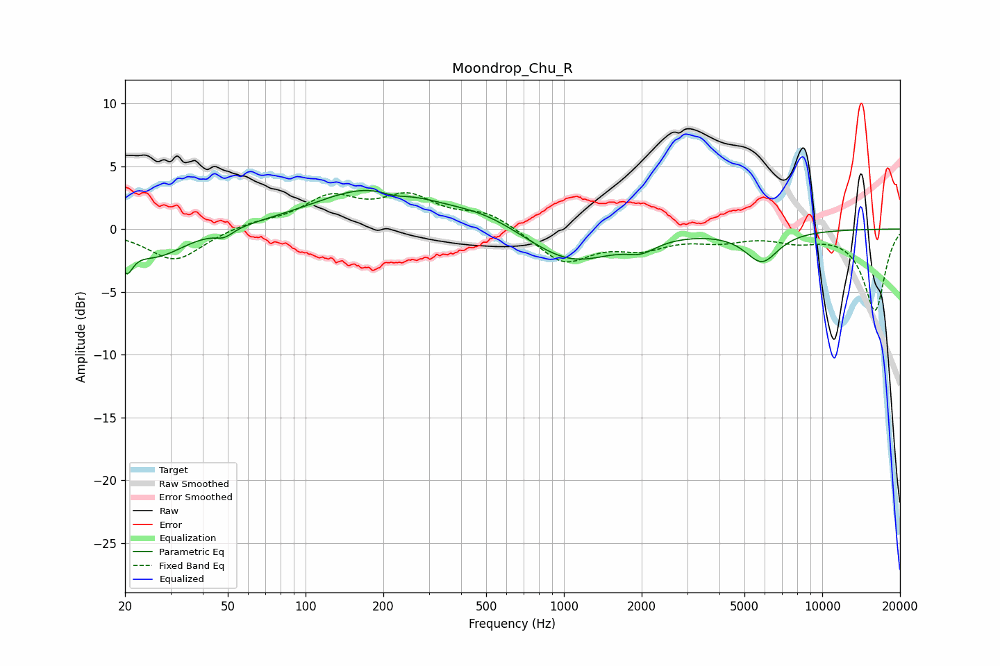

# Moondrop_Chu_R
See [usage instructions](https://github.com/jaakkopasanen/AutoEq#usage) for more options and info.

### Parametric EQs
Apply preamp of -3.2 dB when using parametric equalizer.

|   # | Type    |   Fc (Hz) |    Q |   Gain (dB) |
|-----|---------|-----------|------|-------------|
|   1 | Peaking |        20 | 5.97 |         1   |
|   2 | Peaking |        20 | 5.92 |        -3.1 |
|   3 | Peaking |        26 | 1.23 |        -2.2 |
|   4 | Peaking |        48 | 4.05 |        -0.6 |
|   5 | Peaking |       184 | 0.62 |         3.3 |
|   6 | Peaking |       220 | 2.52 |        -0.5 |
|   7 | Peaking |       497 | 1    |         0.9 |
|   8 | Peaking |      1068 | 0.84 |        -2.7 |
|   9 | Peaking |      1997 | 2.45 |        -0.8 |
|  10 | Peaking |      5837 | 2.12 |        -2.5 |

### Fixed Band EQs
When using fixed band (also called graphic) equalizer, apply preamp of **-3.0 dB** (if available) and set gains manually with these parameters.

|   # | Type    |   Fc (Hz) |    Q |   Gain (dB) |
|-----|---------|-----------|------|-------------|
|   1 | Peaking |        31 | 1.41 |        -2.5 |
|   2 | Peaking |        62 | 1.41 |         0.5 |
|   3 | Peaking |       125 | 1.41 |         2.4 |
|   4 | Peaking |       250 | 1.41 |         2.3 |
|   5 | Peaking |       500 | 1.41 |         1.3 |
|   6 | Peaking |      1000 | 1.41 |        -2.7 |
|   7 | Peaking |      2000 | 1.41 |        -1.3 |
|   8 | Peaking |      4000 | 1.41 |        -0.8 |
|   9 | Peaking |      8000 | 1.41 |        -0.8 |
|  10 | Peaking |     16000 | 1.41 |        -6.5 |

### Graphs

