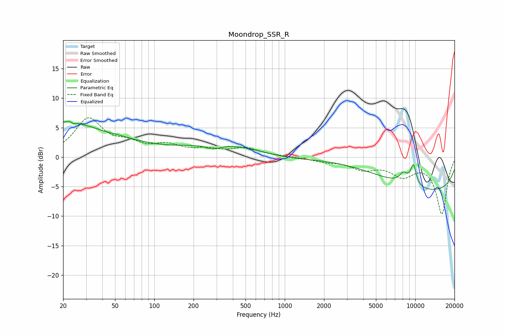

# Moondrop_SSR_R
See [usage instructions](https://github.com/jaakkopasanen/AutoEq#usage) for more options and info.

### Parametric EQs
Apply preamp of -6.1 dB when using parametric equalizer.

|   # | Type    |   Fc (Hz) |    Q |   Gain (dB) |
|-----|---------|-----------|------|-------------|
|   1 | Peaking |        20 | 0.33 |         5.7 |
|   2 | Peaking |        23 | 4.97 |         2.6 |
|   3 | Peaking |        24 | 5.7  |        -2.4 |
|   4 | Peaking |        41 | 2.6  |        -0.2 |
|   5 | Peaking |       284 | 2.41 |        -0.9 |
|   6 | Peaking |      1023 | 0.44 |        -3.9 |
|   7 | Peaking |      1195 | 0.18 |         5.1 |
|   8 | Peaking |      8149 | 3.93 |         1.7 |
|   9 | Peaking |      9692 | 5.4  |         3.5 |
|  10 | Peaking |     10000 | 0.19 |        -6.3 |

### Fixed Band EQs
When using fixed band (also called graphic) equalizer, apply preamp of **-6.8 dB** (if available) and set gains manually with these parameters.

|   # | Type    |   Fc (Hz) |    Q |   Gain (dB) |
|-----|---------|-----------|------|-------------|
|   1 | Peaking |        31 | 1.41 |         6.3 |
|   2 | Peaking |        62 | 1.41 |         1.7 |
|   3 | Peaking |       125 | 1.41 |         1.7 |
|   4 | Peaking |       250 | 1.41 |         1   |
|   5 | Peaking |       500 | 1.41 |         1.4 |
|   6 | Peaking |      1000 | 1.41 |         0.1 |
|   7 | Peaking |      2000 | 1.41 |        -0.6 |
|   8 | Peaking |      4000 | 1.41 |        -1.8 |
|   9 | Peaking |      8000 | 1.41 |        -2.8 |
|  10 | Peaking |     16000 | 1.41 |        -9.5 |

### Graphs

