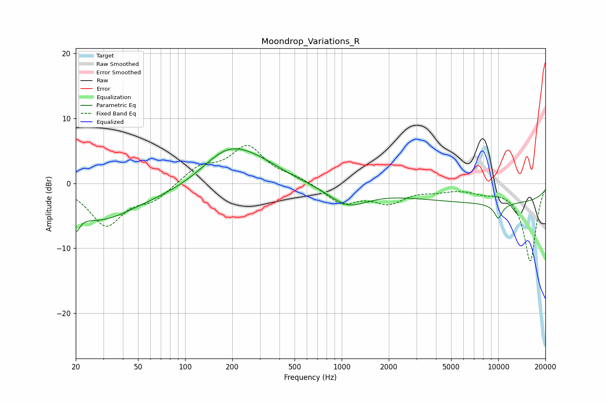

# Moondrop_Variations_R
See [usage instructions](https://github.com/jaakkopasanen/AutoEq#usage) for more options and info.

### Parametric EQs
Apply preamp of -5.4 dB when using parametric equalizer.

|   # | Type    |   Fc (Hz) |    Q |   Gain (dB) |
|-----|---------|-----------|------|-------------|
|   1 | Peaking |        20 | 5.67 |         3.2 |
|   2 | Peaking |        20 | 5.7  |        -6.1 |
|   3 | Peaking |        27 | 0.66 |        -5   |
|   4 | Peaking |        83 | 0.42 |        -1.5 |
|   5 | Peaking |       184 | 0.82 |         5.3 |
|   6 | Peaking |       293 | 0.85 |         1.9 |
|   7 | Peaking |      1098 | 1.1  |        -3   |
|   8 | Peaking |     10000 | 0.18 |        -3   |
|   9 | Peaking |     10000 | 2.59 |        -0.9 |
|  10 | Peaking |     10000 | 5.96 |        -1.4 |

### Fixed Band EQs
When using fixed band (also called graphic) equalizer, apply preamp of **-5.9 dB** (if available) and set gains manually with these parameters.

|   # | Type    |   Fc (Hz) |    Q |   Gain (dB) |
|-----|---------|-----------|------|-------------|
|   1 | Peaking |        31 | 1.41 |        -6.3 |
|   2 | Peaking |        62 | 1.41 |        -2.2 |
|   3 | Peaking |       125 | 1.41 |         2.4 |
|   4 | Peaking |       250 | 1.41 |         5.5 |
|   5 | Peaking |       500 | 1.41 |         0.8 |
|   6 | Peaking |      1000 | 1.41 |        -3   |
|   7 | Peaking |      2000 | 1.41 |        -2.7 |
|   8 | Peaking |      4000 | 1.41 |        -0.8 |
|   9 | Peaking |      8000 | 1.41 |        -0.9 |
|  10 | Peaking |     16000 | 1.41 |       -12   |

### Graphs

