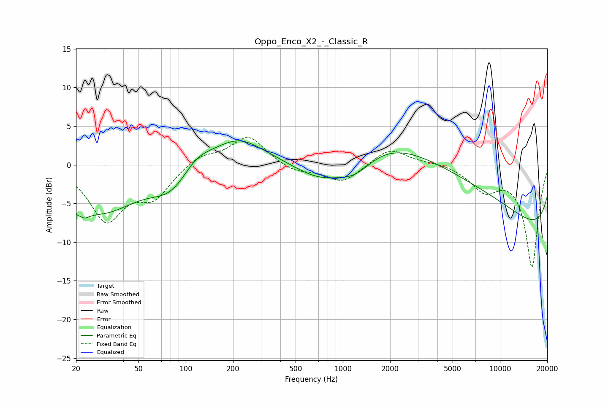

# Oppo_Enco_X2_-_Classic_R
See [usage instructions](https://github.com/jaakkopasanen/AutoEq#usage) for more options and info.

### Parametric EQs
Apply preamp of -3.2 dB when using parametric equalizer.

|   # | Type    |   Fc (Hz) |    Q |   Gain (dB) |
|-----|---------|-----------|------|-------------|
|   1 | Peaking |        21 | 4.14 |        -4.1 |
|   2 | Peaking |        21 | 5.54 |         2.5 |
|   3 | Peaking |        29 | 0.62 |        -5.8 |
|   4 | Peaking |        82 | 1.12 |        -3.1 |
|   5 | Peaking |       116 | 1.4  |         2   |
|   6 | Peaking |       216 | 0.88 |         3.4 |
|   7 | Peaking |       731 | 0.72 |        -4.8 |
|   8 | Peaking |      1203 | 1.2  |        -2.8 |
|   9 | Peaking |      3876 | 0.18 |        10.7 |
|  10 | Peaking |     10000 | 0.18 |       -13   |

### Fixed Band EQs
When using fixed band (also called graphic) equalizer, apply preamp of **-3.6 dB** (if available) and set gains manually with these parameters.

|   # | Type    |   Fc (Hz) |    Q |   Gain (dB) |
|-----|---------|-----------|------|-------------|
|   1 | Peaking |        31 | 1.41 |        -6.9 |
|   2 | Peaking |        62 | 1.41 |        -3.7 |
|   3 | Peaking |       125 | 1.41 |         1.4 |
|   4 | Peaking |       250 | 1.41 |         3.7 |
|   5 | Peaking |       500 | 1.41 |        -1   |
|   6 | Peaking |      1000 | 1.41 |        -2.3 |
|   7 | Peaking |      2000 | 1.41 |         2.2 |
|   8 | Peaking |      4000 | 1.41 |         0.3 |
|   9 | Peaking |      8000 | 1.41 |        -3   |
|  10 | Peaking |     16000 | 1.41 |       -13.2 |

### Graphs

