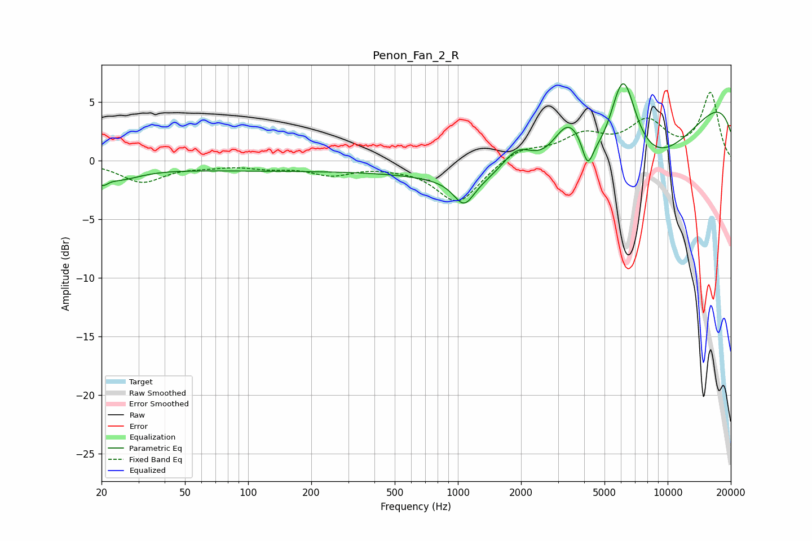

# Penon_Fan_2_R
See [usage instructions](https://github.com/jaakkopasanen/AutoEq#usage) for more options and info.

### Parametric EQs
Apply preamp of -6.7 dB when using parametric equalizer.

|   # | Type    |   Fc (Hz) |    Q |   Gain (dB) |
|-----|---------|-----------|------|-------------|
|   1 | Peaking |        20 | 5.4  |        -0.9 |
|   2 | Peaking |        24 | 1.37 |        -1.1 |
|   3 | Peaking |       136 | 0.18 |        -0.8 |
|   4 | Peaking |      1070 | 2.91 |        -2.2 |
|   5 | Peaking |      1934 | 1.66 |         3.1 |
|   6 | Peaking |      3393 | 1.52 |         6.3 |
|   7 | Peaking |      4150 | 5.82 |        -2.1 |
|   8 | Peaking |      5161 | 0.33 |       -12.5 |
|   9 | Peaking |      6125 | 1.88 |         9.8 |
|  10 | Peaking |     10000 | 0.18 |         8.2 |

### Fixed Band EQs
When using fixed band (also called graphic) equalizer, apply preamp of **-5.9 dB** (if available) and set gains manually with these parameters.

|   # | Type    |   Fc (Hz) |    Q |   Gain (dB) |
|-----|---------|-----------|------|-------------|
|   1 | Peaking |        31 | 1.41 |        -1.8 |
|   2 | Peaking |        62 | 1.41 |        -0.3 |
|   3 | Peaking |       125 | 1.41 |        -0.5 |
|   4 | Peaking |       250 | 1.41 |        -1.1 |
|   5 | Peaking |       500 | 1.41 |        -0.3 |
|   6 | Peaking |      1000 | 1.41 |        -3.6 |
|   7 | Peaking |      2000 | 1.41 |         1.1 |
|   8 | Peaking |      4000 | 1.41 |         2   |
|   9 | Peaking |      8000 | 1.41 |         3   |
|  10 | Peaking |     16000 | 1.41 |         5.7 |

### Graphs

