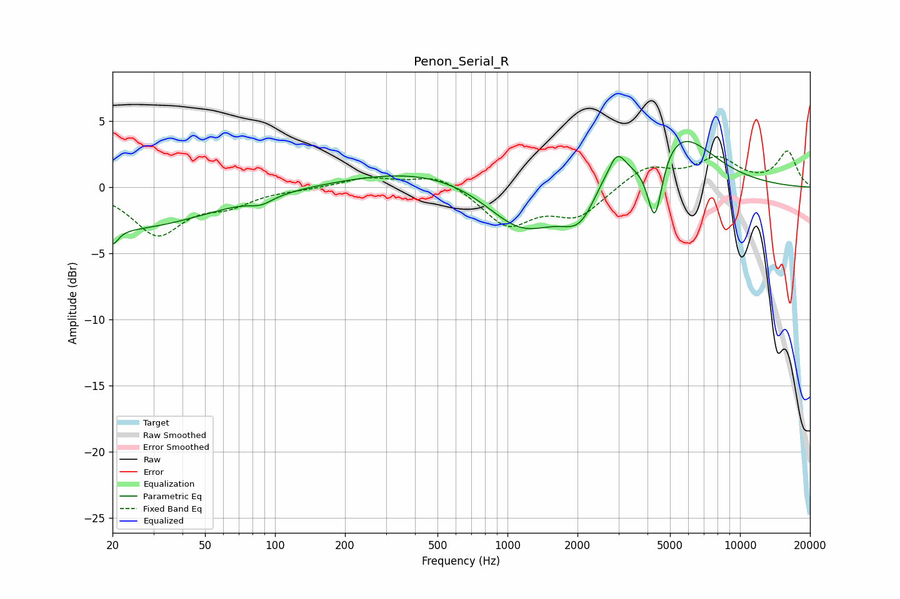

# Penon_Serial_R
See [usage instructions](https://github.com/jaakkopasanen/AutoEq#usage) for more options and info.

### Parametric EQs
Apply preamp of -3.6 dB when using parametric equalizer.

|   # | Type    |   Fc (Hz) |    Q |   Gain (dB) |
|-----|---------|-----------|------|-------------|
|   1 | Peaking |        20 | 5.72 |        -1.2 |
|   2 | Peaking |        22 | 0.39 |        -3.1 |
|   3 | Peaking |        87 | 2.9  |        -0.5 |
|   4 | Peaking |       496 | 0.41 |         1.5 |
|   5 | Peaking |      1151 | 0.89 |        -3.8 |
|   6 | Peaking |      2059 | 1.81 |        -2.5 |
|   7 | Peaking |      2468 | 2.81 |         0.7 |
|   8 | Peaking |      2953 | 3.64 |         2.2 |
|   9 | Peaking |      4301 | 4.39 |        -5.2 |
|  10 | Peaking |      5413 | 0.94 |         4.2 |

### Fixed Band EQs
When using fixed band (also called graphic) equalizer, apply preamp of **-2.8 dB** (if available) and set gains manually with these parameters.

|   # | Type    |   Fc (Hz) |    Q |   Gain (dB) |
|-----|---------|-----------|------|-------------|
|   1 | Peaking |        31 | 1.41 |        -3.5 |
|   2 | Peaking |        62 | 1.41 |        -1.1 |
|   3 | Peaking |       125 | 1.41 |        -0.1 |
|   4 | Peaking |       250 | 1.41 |         0.7 |
|   5 | Peaking |       500 | 1.41 |         1   |
|   6 | Peaking |      1000 | 1.41 |        -2.8 |
|   7 | Peaking |      2000 | 1.41 |        -2.1 |
|   8 | Peaking |      4000 | 1.41 |         1.6 |
|   9 | Peaking |      8000 | 1.41 |         2   |
|  10 | Peaking |     16000 | 1.41 |         2.6 |

### Graphs

