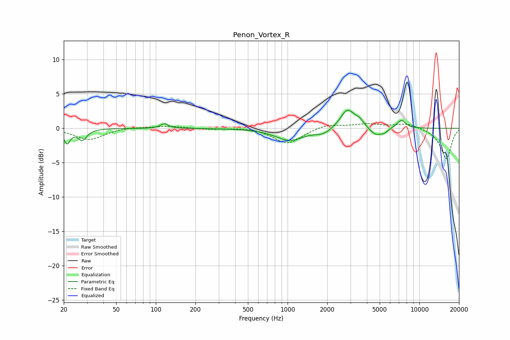

# Penon_Vortex_R
See [usage instructions](https://github.com/jaakkopasanen/AutoEq#usage) for more options and info.

### Parametric EQs
Apply preamp of -2.7 dB when using parametric equalizer.

|   # | Type    |   Fc (Hz) |    Q |   Gain (dB) |
|-----|---------|-----------|------|-------------|
|   1 | Peaking |        21 | 5.94 |        -2   |
|   2 | Peaking |        28 | 4.31 |        -1.6 |
|   3 | Peaking |       116 | 4.76 |         0.7 |
|   4 | Peaking |      1038 | 1.33 |        -1.7 |
|   5 | Peaking |      1869 | 2.24 |        -0.7 |
|   6 | Peaking |      2848 | 2.6  |         2.8 |
|   7 | Peaking |      3517 | 4.17 |         0.8 |
|   8 | Peaking |      4658 | 2.99 |        -1.1 |
|   9 | Peaking |      5420 | 5.24 |        -0.5 |
|  10 | Peaking |      7285 | 3.93 |         1.2 |

### Fixed Band EQs
When using fixed band (also called graphic) equalizer, apply preamp of **-0.8 dB** (if available) and set gains manually with these parameters.

|   # | Type    |   Fc (Hz) |    Q |   Gain (dB) |
|-----|---------|-----------|------|-------------|
|   1 | Peaking |        31 | 1.41 |        -1.7 |
|   2 | Peaking |        62 | 1.41 |         0.2 |
|   3 | Peaking |       125 | 1.41 |         0.3 |
|   4 | Peaking |       250 | 1.41 |        -0.1 |
|   5 | Peaking |       500 | 1.41 |         0.2 |
|   6 | Peaking |      1000 | 1.41 |        -2.3 |
|   7 | Peaking |      2000 | 1.41 |         0.6 |
|   8 | Peaking |      4000 | 1.41 |         0.6 |
|   9 | Peaking |      8000 | 1.41 |         0.7 |
|  10 | Peaking |     16000 | 1.41 |        -4.5 |

### Graphs

