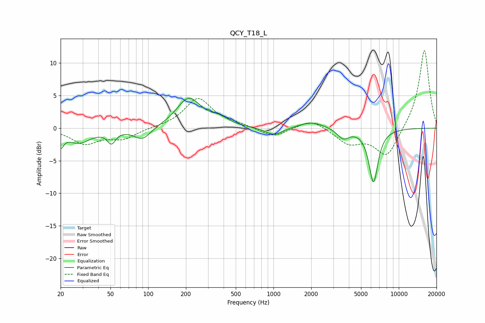

# QCY_T18_L
See [usage instructions](https://github.com/jaakkopasanen/AutoEq#usage) for more options and info.

### Parametric EQs
Apply preamp of -4.7 dB when using parametric equalizer.

|   # | Type    |   Fc (Hz) |    Q |   Gain (dB) |
|-----|---------|-----------|------|-------------|
|   1 | Peaking |        20 | 5.91 |        -2   |
|   2 | Peaking |        28 | 1.5  |        -2.2 |
|   3 | Peaking |        51 | 4.31 |        -1.9 |
|   4 | Peaking |        90 | 2.11 |        -1.9 |
|   5 | Peaking |       211 | 1.47 |         4.6 |
|   6 | Peaking |       369 | 1.95 |         1   |
|   7 | Peaking |      1009 | 2    |        -1.2 |
|   8 | Peaking |      2023 | 1.35 |         1   |
|   9 | Peaking |      3596 | 2.96 |        -1.5 |
|  10 | Peaking |      6281 | 3.73 |        -8.2 |

### Fixed Band EQs
When using fixed band (also called graphic) equalizer, apply preamp of **-12.0 dB** (if available) and set gains manually with these parameters.

|   # | Type    |   Fc (Hz) |    Q |   Gain (dB) |
|-----|---------|-----------|------|-------------|
|   1 | Peaking |        31 | 1.41 |        -2.3 |
|   2 | Peaking |        62 | 1.41 |        -1.5 |
|   3 | Peaking |       125 | 1.41 |         0.1 |
|   4 | Peaking |       250 | 1.41 |         4.6 |
|   5 | Peaking |       500 | 1.41 |         0.5 |
|   6 | Peaking |      1000 | 1.41 |        -1.4 |
|   7 | Peaking |      2000 | 1.41 |         1.5 |
|   8 | Peaking |      4000 | 1.41 |        -2.3 |
|   9 | Peaking |      8000 | 1.41 |        -4.5 |
|  10 | Peaking |     16000 | 1.41 |        12.2 |

### Graphs

