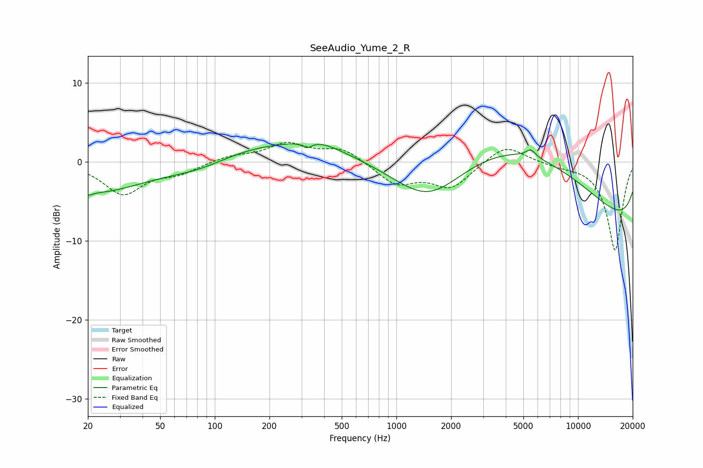

# SeeAudio_Yume_2_R
See [usage instructions](https://github.com/jaakkopasanen/AutoEq#usage) for more options and info.

### Parametric EQs
Apply preamp of -2.4 dB when using parametric equalizer.

|   # | Type    |   Fc (Hz) |    Q |   Gain (dB) |
|-----|---------|-----------|------|-------------|
|   1 | Peaking |        20 | 5.81 |        -0.4 |
|   2 | Peaking |        22 | 0.52 |        -3.8 |
|   3 | Peaking |        82 | 0.71 |        -1.9 |
|   4 | Peaking |       161 | 0.38 |         2.5 |
|   5 | Peaking |       322 | 5.81 |        -0.7 |
|   6 | Peaking |       376 | 1.06 |         1.3 |
|   7 | Peaking |      1496 | 0.64 |        -7.5 |
|   8 | Peaking |      4954 | 0.25 |        13.2 |
|   9 | Peaking |      5502 | 5.14 |         0.9 |
|  10 | Peaking |     10000 | 0.18 |       -12.6 |

### Fixed Band EQs
When using fixed band (also called graphic) equalizer, apply preamp of **-2.6 dB** (if available) and set gains manually with these parameters.

|   # | Type    |   Fc (Hz) |    Q |   Gain (dB) |
|-----|---------|-----------|------|-------------|
|   1 | Peaking |        31 | 1.41 |        -4   |
|   2 | Peaking |        62 | 1.41 |        -1.2 |
|   3 | Peaking |       125 | 1.41 |         0.7 |
|   4 | Peaking |       250 | 1.41 |         2.2 |
|   5 | Peaking |       500 | 1.41 |         1.7 |
|   6 | Peaking |      1000 | 1.41 |        -2.7 |
|   7 | Peaking |      2000 | 1.41 |        -3.2 |
|   8 | Peaking |      4000 | 1.41 |         2.4 |
|   9 | Peaking |      8000 | 1.41 |        -0.4 |
|  10 | Peaking |     16000 | 1.41 |       -11.2 |

### Graphs

