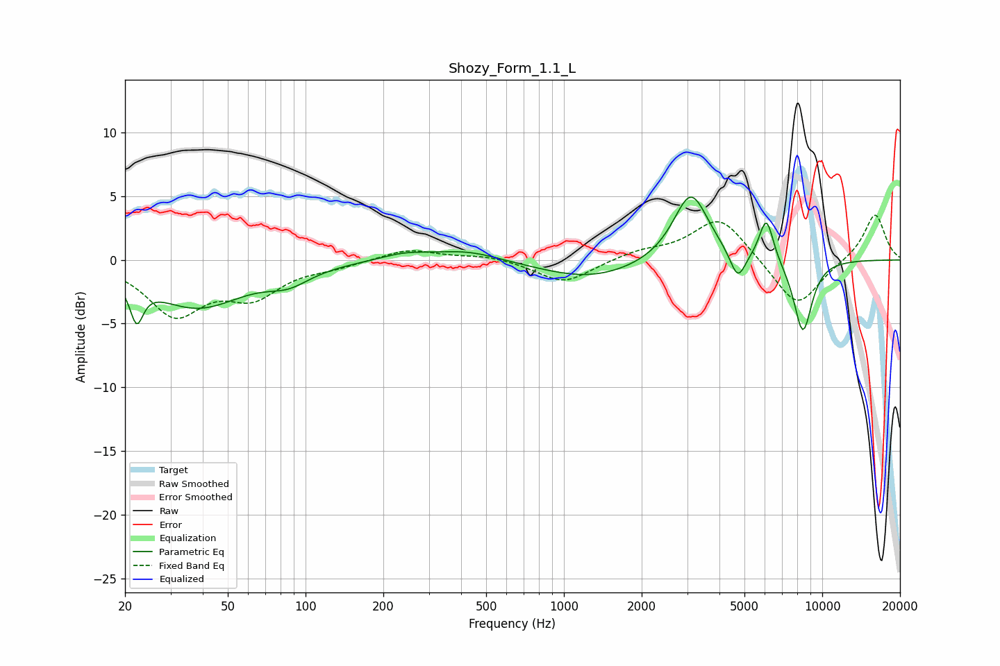

# Shozy_Form_1.1_L
See [usage instructions](https://github.com/jaakkopasanen/AutoEq#usage) for more options and info.

### Parametric EQs
Apply preamp of -5.0 dB when using parametric equalizer.

|   # | Type    |   Fc (Hz) |    Q |   Gain (dB) |
|-----|---------|-----------|------|-------------|
|   1 | Peaking |        22 | 5.64 |        -3   |
|   2 | Peaking |        38 | 0.78 |        -3.6 |
|   3 | Peaking |        86 | 1.68 |        -1.1 |
|   4 | Peaking |       241 | 1.5  |         0.5 |
|   5 | Peaking |       421 | 1.08 |         0.8 |
|   6 | Peaking |      1266 | 0.73 |        -1.5 |
|   7 | Peaking |      3101 | 2.06 |         5.5 |
|   8 | Peaking |      4710 | 4.65 |        -2.3 |
|   9 | Peaking |      6078 | 4.91 |         3.5 |
|  10 | Peaking |      8414 | 3.56 |        -5.8 |

### Fixed Band EQs
When using fixed band (also called graphic) equalizer, apply preamp of **-3.6 dB** (if available) and set gains manually with these parameters.

|   # | Type    |   Fc (Hz) |    Q |   Gain (dB) |
|-----|---------|-----------|------|-------------|
|   1 | Peaking |        31 | 1.41 |        -4.1 |
|   2 | Peaking |        62 | 1.41 |        -2.5 |
|   3 | Peaking |       125 | 1.41 |        -0.4 |
|   4 | Peaking |       250 | 1.41 |         0.9 |
|   5 | Peaking |       500 | 1.41 |         0.4 |
|   6 | Peaking |      1000 | 1.41 |        -1.9 |
|   7 | Peaking |      2000 | 1.41 |         0.6 |
|   8 | Peaking |      4000 | 1.41 |         3.4 |
|   9 | Peaking |      8000 | 1.41 |        -3.8 |
|  10 | Peaking |     16000 | 1.41 |         3.7 |

### Graphs

