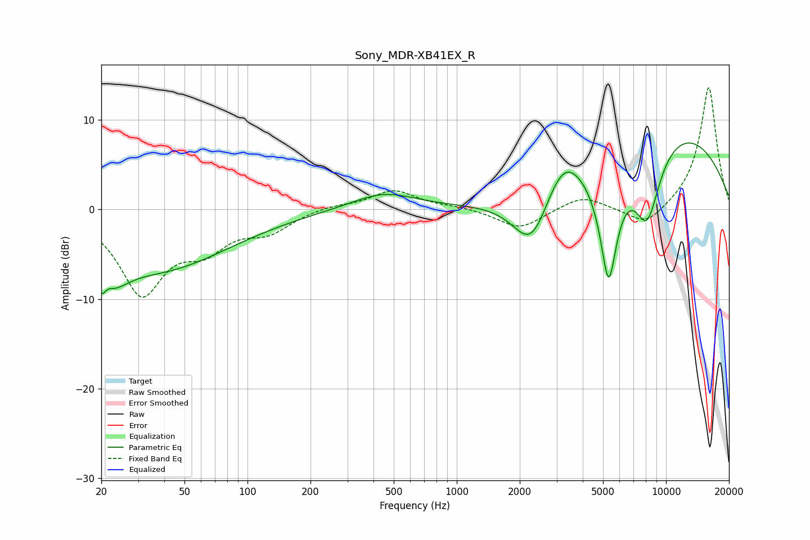

# Sony_MDR-XB41EX_R
See [usage instructions](https://github.com/jaakkopasanen/AutoEq#usage) for more options and info.

### Parametric EQs
Apply preamp of -7.5 dB when using parametric equalizer.

|   # | Type    |   Fc (Hz) |    Q |   Gain (dB) |
|-----|---------|-----------|------|-------------|
|   1 | Peaking |        21 | 4.72 |        -5.3 |
|   2 | Peaking |        21 | 5.89 |         3   |
|   3 | Peaking |        23 | 1.9  |        -2.2 |
|   4 | Peaking |        37 | 0.41 |        -6.6 |
|   5 | Peaking |       447 | 0.91 |         1.9 |
|   6 | Peaking |      2279 | 1.56 |        -6.6 |
|   7 | Peaking |      3222 | 1.59 |         4.2 |
|   8 | Peaking |      5318 | 3.1  |       -13.2 |
|   9 | Peaking |      8125 | 1.99 |        -8.7 |
|  10 | Peaking |     10000 | 0.31 |         9.3 |

### Fixed Band EQs
When using fixed band (also called graphic) equalizer, apply preamp of **-13.7 dB** (if available) and set gains manually with these parameters.

|   # | Type    |   Fc (Hz) |    Q |   Gain (dB) |
|-----|---------|-----------|------|-------------|
|   1 | Peaking |        31 | 1.41 |        -9.1 |
|   2 | Peaking |        62 | 1.41 |        -3.5 |
|   3 | Peaking |       125 | 1.41 |        -2.1 |
|   4 | Peaking |       250 | 1.41 |         0.5 |
|   5 | Peaking |       500 | 1.41 |         2.1 |
|   6 | Peaking |      1000 | 1.41 |         0.3 |
|   7 | Peaking |      2000 | 1.41 |        -2.2 |
|   8 | Peaking |      4000 | 1.41 |         1.6 |
|   9 | Peaking |      8000 | 1.41 |        -2.1 |
|  10 | Peaking |     16000 | 1.41 |        13.8 |

### Graphs

