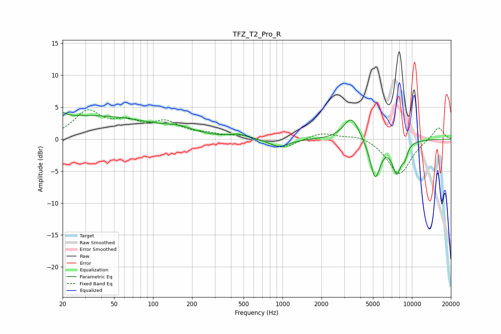

# TFZ_T2_Pro_R
See [usage instructions](https://github.com/jaakkopasanen/AutoEq#usage) for more options and info.

### Parametric EQs
Apply preamp of -4.3 dB when using parametric equalizer.

|   # | Type    |   Fc (Hz) |    Q |   Gain (dB) |
|-----|---------|-----------|------|-------------|
|   1 | Peaking |        20 | 5.96 |         3.2 |
|   2 | Peaking |        20 | 6    |        -2.5 |
|   3 | Peaking |        31 | 0.25 |         3.7 |
|   4 | Peaking |       161 | 1.38 |         0.7 |
|   5 | Peaking |       455 | 2.3  |         0.6 |
|   6 | Peaking |       945 | 1.88 |        -1.3 |
|   7 | Peaking |      3410 | 2.32 |         3.7 |
|   8 | Peaking |      5195 | 3.48 |        -6.1 |
|   9 | Peaking |      7640 | 3.63 |        -4.8 |
|  10 | Peaking |      8807 | 5.99 |        -1.6 |

### Fixed Band EQs
When using fixed band (also called graphic) equalizer, apply preamp of **-4.7 dB** (if available) and set gains manually with these parameters.

|   # | Type    |   Fc (Hz) |    Q |   Gain (dB) |
|-----|---------|-----------|------|-------------|
|   1 | Peaking |        31 | 1.41 |         4.1 |
|   2 | Peaking |        62 | 1.41 |         2.1 |
|   3 | Peaking |       125 | 1.41 |         2.3 |
|   4 | Peaking |       250 | 1.41 |         0.6 |
|   5 | Peaking |       500 | 1.41 |         0.6 |
|   6 | Peaking |      1000 | 1.41 |        -1.5 |
|   7 | Peaking |      2000 | 1.41 |         1.1 |
|   8 | Peaking |      4000 | 1.41 |         0.8 |
|   9 | Peaking |      8000 | 1.41 |        -5.6 |
|  10 | Peaking |     16000 | 1.41 |         2   |

### Graphs

