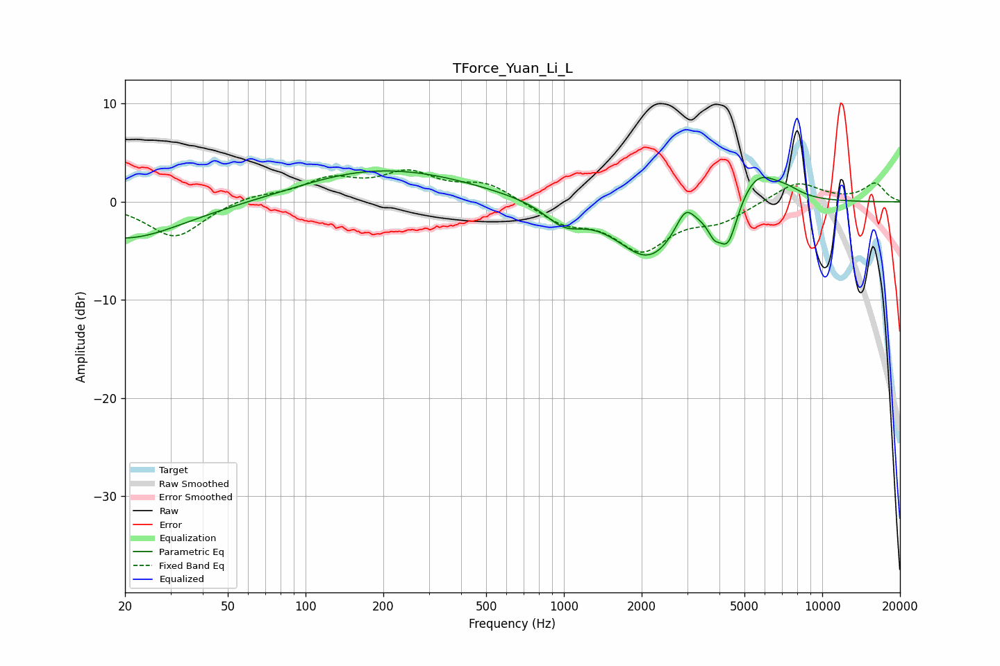

# TForce_Yuan_Li_L
See [usage instructions](https://github.com/jaakkopasanen/AutoEq#usage) for more options and info.

### Parametric EQs
Apply preamp of -3.2 dB when using parametric equalizer.

|   # | Type    |   Fc (Hz) |    Q |   Gain (dB) |
|-----|---------|-----------|------|-------------|
|   1 | Peaking |        20 | 0.64 |        -3.8 |
|   2 | Peaking |       145 | 0.6  |         1.6 |
|   3 | Peaking |       277 | 0.51 |         2.1 |
|   4 | Peaking |      1000 | 1.93 |        -2   |
|   5 | Peaking |      2133 | 1.14 |        -5.8 |
|   6 | Peaking |      2950 | 3.75 |         2.5 |
|   7 | Peaking |      3812 | 5.94 |        -1.5 |
|   8 | Peaking |      4318 | 3.77 |        -4.4 |
|   9 | Peaking |      5597 | 1.72 |         3.5 |
|  10 | Peaking |      7318 | 2.37 |         0.7 |

### Fixed Band EQs
When using fixed band (also called graphic) equalizer, apply preamp of **-3.4 dB** (if available) and set gains manually with these parameters.

|   # | Type    |   Fc (Hz) |    Q |   Gain (dB) |
|-----|---------|-----------|------|-------------|
|   1 | Peaking |        31 | 1.41 |        -3.7 |
|   2 | Peaking |        62 | 1.41 |         0.7 |
|   3 | Peaking |       125 | 1.41 |         2.1 |
|   4 | Peaking |       250 | 1.41 |         2.7 |
|   5 | Peaking |       500 | 1.41 |         1.8 |
|   6 | Peaking |      1000 | 1.41 |        -1.9 |
|   7 | Peaking |      2000 | 1.41 |        -4.6 |
|   8 | Peaking |      4000 | 1.41 |        -1.7 |
|   9 | Peaking |      8000 | 1.41 |         2.1 |
|  10 | Peaking |     16000 | 1.41 |         1.8 |

### Graphs

