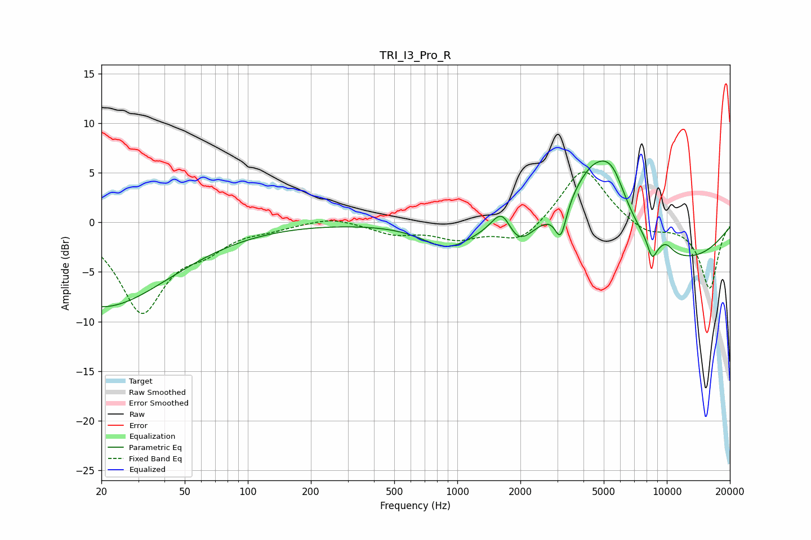

# TRI_I3_Pro_R
See [usage instructions](https://github.com/jaakkopasanen/AutoEq#usage) for more options and info.

### Parametric EQs
Apply preamp of -6.3 dB when using parametric equalizer.

|   # | Type    |   Fc (Hz) |    Q |   Gain (dB) |
|-----|---------|-----------|------|-------------|
|   1 | Peaking |        20 | 0.43 |        -8.5 |
|   2 | Peaking |       897 | 1.2  |        -2.4 |
|   3 | Peaking |      1645 | 2.72 |         3.4 |
|   4 | Peaking |      1904 | 1.88 |        -3.3 |
|   5 | Peaking |      3117 | 5.08 |        -3.4 |
|   6 | Peaking |      4549 | 1.08 |         7.6 |
|   7 | Peaking |      5531 | 2.2  |         2.8 |
|   8 | Peaking |      8507 | 5.89 |        -1.9 |
|   9 | Peaking |      9900 | 3.72 |         0.9 |
|  10 | Peaking |     10000 | 0.34 |        -4.3 |

### Fixed Band EQs
When using fixed band (also called graphic) equalizer, apply preamp of **-5.2 dB** (if available) and set gains manually with these parameters.

|   # | Type    |   Fc (Hz) |    Q |   Gain (dB) |
|-----|---------|-----------|------|-------------|
|   1 | Peaking |        31 | 1.41 |        -8.8 |
|   2 | Peaking |        62 | 1.41 |        -2   |
|   3 | Peaking |       125 | 1.41 |        -0.5 |
|   4 | Peaking |       250 | 1.41 |         0.6 |
|   5 | Peaking |       500 | 1.41 |        -1.1 |
|   6 | Peaking |      1000 | 1.41 |        -1.5 |
|   7 | Peaking |      2000 | 1.41 |        -2.1 |
|   8 | Peaking |      4000 | 1.41 |         5.7 |
|   9 | Peaking |      8000 | 1.41 |        -1.2 |
|  10 | Peaking |     16000 | 1.41 |        -6.7 |

### Graphs

