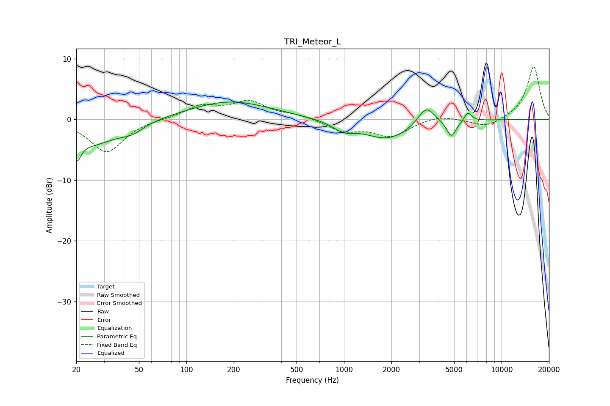

# TRI_Meteor_L
See [usage instructions](https://github.com/jaakkopasanen/AutoEq#usage) for more options and info.

### Parametric EQs
Apply preamp of -2.9 dB when using parametric equalizer.

|   # | Type    |   Fc (Hz) |    Q |   Gain (dB) |
|-----|---------|-----------|------|-------------|
|   1 | Peaking |        20 | 5.8  |        -5.8 |
|   2 | Peaking |        20 | 6    |         2.5 |
|   3 | Peaking |        25 | 0.8  |        -4   |
|   4 | Peaking |        45 | 2.16 |        -1.1 |
|   5 | Peaking |       188 | 0.54 |         3   |
|   6 | Peaking |       992 | 2.06 |        -1.4 |
|   7 | Peaking |      1894 | 0.94 |        -3.2 |
|   8 | Peaking |      3322 | 2.65 |         3.1 |
|   9 | Peaking |      4804 | 4.59 |        -2.8 |
|  10 | Peaking |      6105 | 6    |         1.5 |

### Fixed Band EQs
When using fixed band (also called graphic) equalizer, apply preamp of **-8.8 dB** (if available) and set gains manually with these parameters.

|   # | Type    |   Fc (Hz) |    Q |   Gain (dB) |
|-----|---------|-----------|------|-------------|
|   1 | Peaking |        31 | 1.41 |        -5.4 |
|   2 | Peaking |        62 | 1.41 |         0.1 |
|   3 | Peaking |       125 | 1.41 |         2.1 |
|   4 | Peaking |       250 | 1.41 |         2.7 |
|   5 | Peaking |       500 | 1.41 |         0.7 |
|   6 | Peaking |      1000 | 1.41 |        -1.8 |
|   7 | Peaking |      2000 | 1.41 |        -2.7 |
|   8 | Peaking |      4000 | 1.41 |         0.8 |
|   9 | Peaking |      8000 | 1.41 |        -1.4 |
|  10 | Peaking |     16000 | 1.41 |         8.8 |

### Graphs

