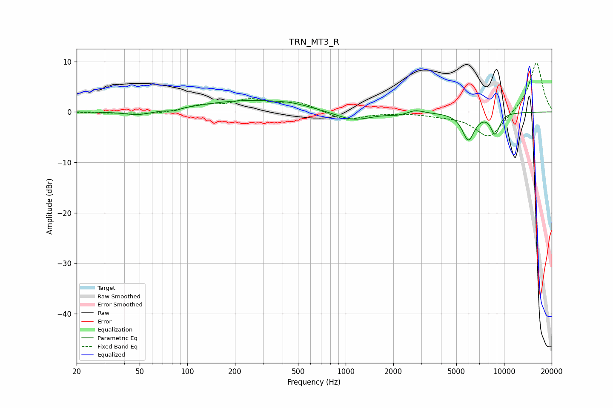

# TRN_MT3_R
See [usage instructions](https://github.com/jaakkopasanen/AutoEq#usage) for more options and info.

### Parametric EQs
Apply preamp of -2.4 dB when using parametric equalizer.

|   # | Type    |   Fc (Hz) |    Q |   Gain (dB) |
|-----|---------|-----------|------|-------------|
|   1 | Peaking |        49 | 1.64 |        -0.9 |
|   2 | Peaking |        82 | 4.28 |        -0.5 |
|   3 | Peaking |       229 | 0.51 |         2.1 |
|   4 | Peaking |       452 | 1.13 |         0.7 |
|   5 | Peaking |      1119 | 1.26 |        -1.8 |
|   6 | Peaking |      2171 | 2.4  |        -0.5 |
|   7 | Peaking |      2738 | 2.94 |         0.7 |
|   8 | Peaking |      5956 | 3.59 |        -5.4 |
|   9 | Peaking |      8725 | 4.85 |        -3.5 |
|  10 | Peaking |      9174 | 6    |        -0.8 |

### Fixed Band EQs
When using fixed band (also called graphic) equalizer, apply preamp of **-9.8 dB** (if available) and set gains manually with these parameters.

|   # | Type    |   Fc (Hz) |    Q |   Gain (dB) |
|-----|---------|-----------|------|-------------|
|   1 | Peaking |        31 | 1.41 |        -0.2 |
|   2 | Peaking |        62 | 1.41 |        -0.5 |
|   3 | Peaking |       125 | 1.41 |         1.2 |
|   4 | Peaking |       250 | 1.41 |         2.2 |
|   5 | Peaking |       500 | 1.41 |         1.8 |
|   6 | Peaking |      1000 | 1.41 |        -1.7 |
|   7 | Peaking |      2000 | 1.41 |        -0   |
|   8 | Peaking |      4000 | 1.41 |        -0.5 |
|   9 | Peaking |      8000 | 1.41 |        -5.2 |
|  10 | Peaking |     16000 | 1.41 |        10   |

### Graphs

