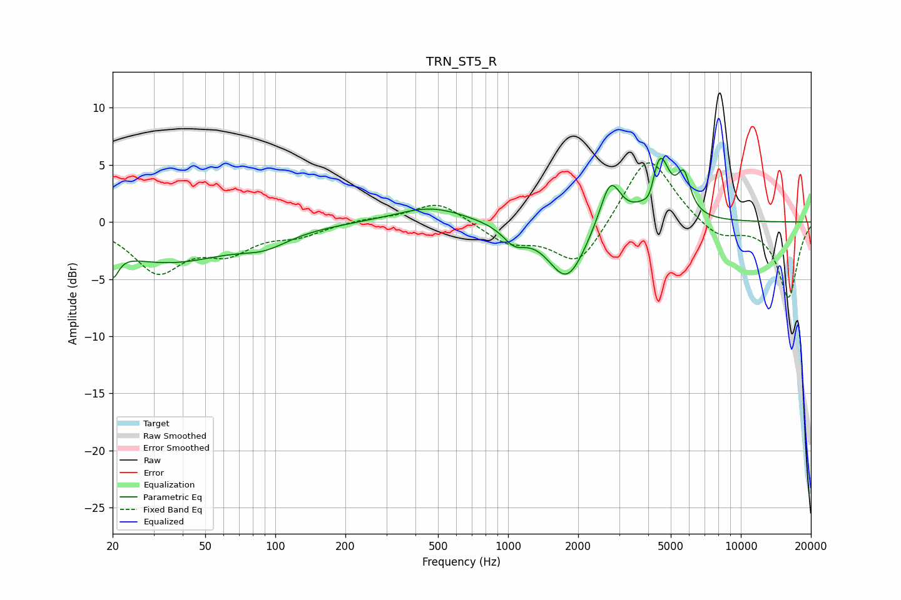

# TRN_ST5_R
See [usage instructions](https://github.com/jaakkopasanen/AutoEq#usage) for more options and info.

### Parametric EQs
Apply preamp of -5.7 dB when using parametric equalizer.

|   # | Type    |   Fc (Hz) |    Q |   Gain (dB) |
|-----|---------|-----------|------|-------------|
|   1 | Peaking |        20 | 5.71 |        -2.3 |
|   2 | Peaking |        34 | 0.51 |        -3.4 |
|   3 | Peaking |        90 | 1.38 |        -1.1 |
|   4 | Peaking |       466 | 0.94 |         1.4 |
|   5 | Peaking |      1065 | 2.85 |        -1.4 |
|   6 | Peaking |      1790 | 1.73 |        -5.1 |
|   7 | Peaking |      2748 | 3.09 |         4.2 |
|   8 | Peaking |      4078 | 5.49 |        -1.7 |
|   9 | Peaking |      4469 | 3.31 |         5.8 |
|  10 | Peaking |      5690 | 4.94 |         3.2 |

### Fixed Band EQs
When using fixed band (also called graphic) equalizer, apply preamp of **-5.3 dB** (if available) and set gains manually with these parameters.

|   # | Type    |   Fc (Hz) |    Q |   Gain (dB) |
|-----|---------|-----------|------|-------------|
|   1 | Peaking |        31 | 1.41 |        -4.1 |
|   2 | Peaking |        62 | 1.41 |        -2.2 |
|   3 | Peaking |       125 | 1.41 |        -1   |
|   4 | Peaking |       250 | 1.41 |         0.3 |
|   5 | Peaking |       500 | 1.41 |         1.9 |
|   6 | Peaking |      1000 | 1.41 |        -1.7 |
|   7 | Peaking |      2000 | 1.41 |        -3.9 |
|   8 | Peaking |      4000 | 1.41 |         6.2 |
|   9 | Peaking |      8000 | 1.41 |        -1.5 |
|  10 | Peaking |     16000 | 1.41 |        -6.6 |

### Graphs

