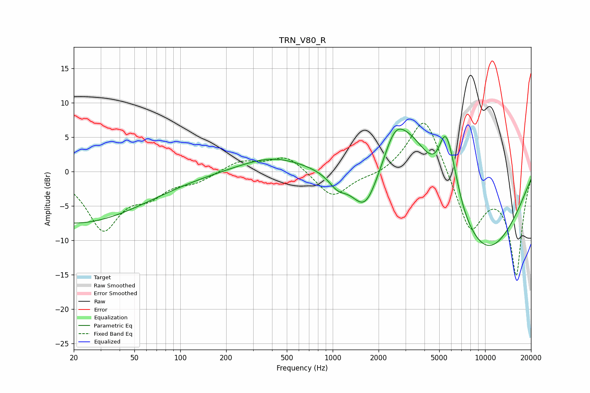

# TRN_V80_R
See [usage instructions](https://github.com/jaakkopasanen/AutoEq#usage) for more options and info.

### Parametric EQs
Apply preamp of -6.3 dB when using parametric equalizer.

|   # | Type    |   Fc (Hz) |    Q |   Gain (dB) |
|-----|---------|-----------|------|-------------|
|   1 | Peaking |        20 | 0.29 |        -7.5 |
|   2 | Peaking |       401 | 0.66 |         2.2 |
|   3 | Peaking |      1076 | 2.4  |        -1.9 |
|   4 | Peaking |      1635 | 1.55 |        -6.6 |
|   5 | Peaking |      2560 | 1.98 |         4.1 |
|   6 | Peaking |      3272 | 0.88 |         7.8 |
|   7 | Peaking |      5264 | 4.11 |         1.2 |
|   8 | Peaking |      5534 | 3.22 |         4.9 |
|   9 | Peaking |      6051 | 2.41 |         4.3 |
|  10 | Peaking |      9819 | 0.43 |       -12.1 |

### Fixed Band EQs
When using fixed band (also called graphic) equalizer, apply preamp of **-7.1 dB** (if available) and set gains manually with these parameters.

|   # | Type    |   Fc (Hz) |    Q |   Gain (dB) |
|-----|---------|-----------|------|-------------|
|   1 | Peaking |        31 | 1.41 |        -8.2 |
|   2 | Peaking |        62 | 1.41 |        -2.7 |
|   3 | Peaking |       125 | 1.41 |        -1.3 |
|   4 | Peaking |       250 | 1.41 |         1.6 |
|   5 | Peaking |       500 | 1.41 |         2.4 |
|   6 | Peaking |      1000 | 1.41 |        -3.9 |
|   7 | Peaking |      2000 | 1.41 |        -0.7 |
|   8 | Peaking |      4000 | 1.41 |         8.8 |
|   9 | Peaking |      8000 | 1.41 |        -8.6 |
|  10 | Peaking |     16000 | 1.41 |       -14.8 |

### Graphs

