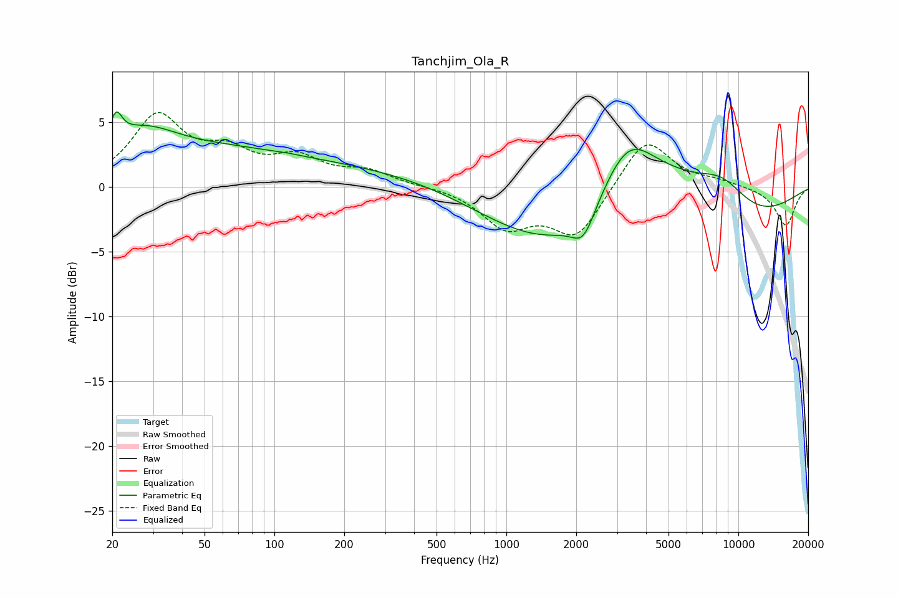

# Tanchjim_Ola_R
See [usage instructions](https://github.com/jaakkopasanen/AutoEq#usage) for more options and info.

### Parametric EQs
Apply preamp of -5.9 dB when using parametric equalizer.

|   # | Type    |   Fc (Hz) |    Q |   Gain (dB) |
|-----|---------|-----------|------|-------------|
|   1 | Peaking |        21 | 5.56 |         2.1 |
|   2 | Peaking |        26 | 0.9  |         3.1 |
|   3 | Peaking |       114 | 5.81 |         0   |
|   4 | Peaking |       186 | 0.18 |         4.1 |
|   5 | Peaking |       524 | 0.18 |        -2.5 |
|   6 | Peaking |      2149 | 2.9  |        -2.1 |
|   7 | Peaking |      3326 | 0.99 |         7.6 |
|   8 | Peaking |      3927 | 0.23 |        -6.4 |
|   9 | Peaking |      5473 | 0.74 |         3.5 |
|  10 | Peaking |      8465 | 1.09 |         2.9 |

### Fixed Band EQs
When using fixed band (also called graphic) equalizer, apply preamp of **-5.8 dB** (if available) and set gains manually with these parameters.

|   # | Type    |   Fc (Hz) |    Q |   Gain (dB) |
|-----|---------|-----------|------|-------------|
|   1 | Peaking |        31 | 1.41 |         5.2 |
|   2 | Peaking |        62 | 1.41 |         2.2 |
|   3 | Peaking |       125 | 1.41 |         1.9 |
|   4 | Peaking |       250 | 1.41 |         1.1 |
|   5 | Peaking |       500 | 1.41 |         0.1 |
|   6 | Peaking |      1000 | 1.41 |        -2.9 |
|   7 | Peaking |      2000 | 1.41 |        -3.8 |
|   8 | Peaking |      4000 | 1.41 |         3.9 |
|   9 | Peaking |      8000 | 1.41 |         0.4 |
|  10 | Peaking |     16000 | 1.41 |        -3   |

### Graphs

