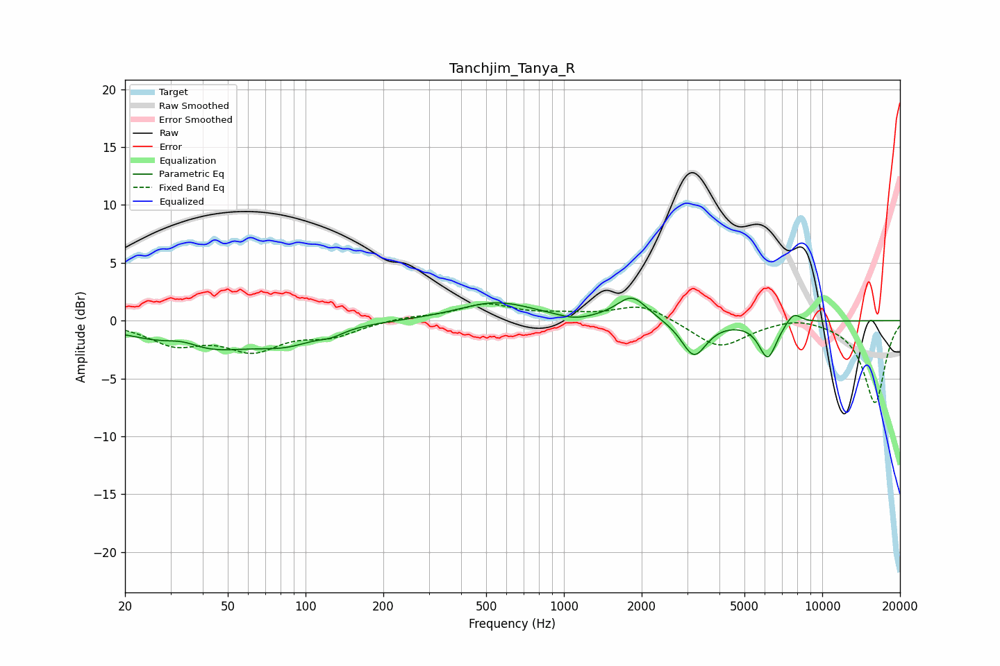

# Tanchjim_Tanya_R
See [usage instructions](https://github.com/jaakkopasanen/AutoEq#usage) for more options and info.

### Parametric EQs
Apply preamp of -2.0 dB when using parametric equalizer.

|   # | Type    |   Fc (Hz) |    Q |   Gain (dB) |
|-----|---------|-----------|------|-------------|
|   1 | Peaking |        33 | 2.13 |         0.7 |
|   2 | Peaking |        39 | 0.68 |        -2.6 |
|   3 | Peaking |        85 | 1.27 |        -1.2 |
|   4 | Peaking |       126 | 2.85 |        -0.5 |
|   5 | Peaking |       547 | 0.97 |         1.6 |
|   6 | Peaking |      1099 | 2.27 |        -0.4 |
|   7 | Peaking |      1834 | 2.4  |         2.1 |
|   8 | Peaking |      3189 | 2.93 |        -3.1 |
|   9 | Peaking |      6157 | 3.94 |        -3.2 |
|  10 | Peaking |      7741 | 4.38 |         1   |

### Fixed Band EQs
When using fixed band (also called graphic) equalizer, apply preamp of **-1.5 dB** (if available) and set gains manually with these parameters.

|   # | Type    |   Fc (Hz) |    Q |   Gain (dB) |
|-----|---------|-----------|------|-------------|
|   1 | Peaking |        31 | 1.41 |        -1.9 |
|   2 | Peaking |        62 | 1.41 |        -2.3 |
|   3 | Peaking |       125 | 1.41 |        -1.2 |
|   4 | Peaking |       250 | 1.41 |         0.3 |
|   5 | Peaking |       500 | 1.41 |         1.4 |
|   6 | Peaking |      1000 | 1.41 |         0.4 |
|   7 | Peaking |      2000 | 1.41 |         1.4 |
|   8 | Peaking |      4000 | 1.41 |        -2.4 |
|   9 | Peaking |      8000 | 1.41 |         0.5 |
|  10 | Peaking |     16000 | 1.41 |        -7.1 |

### Graphs

