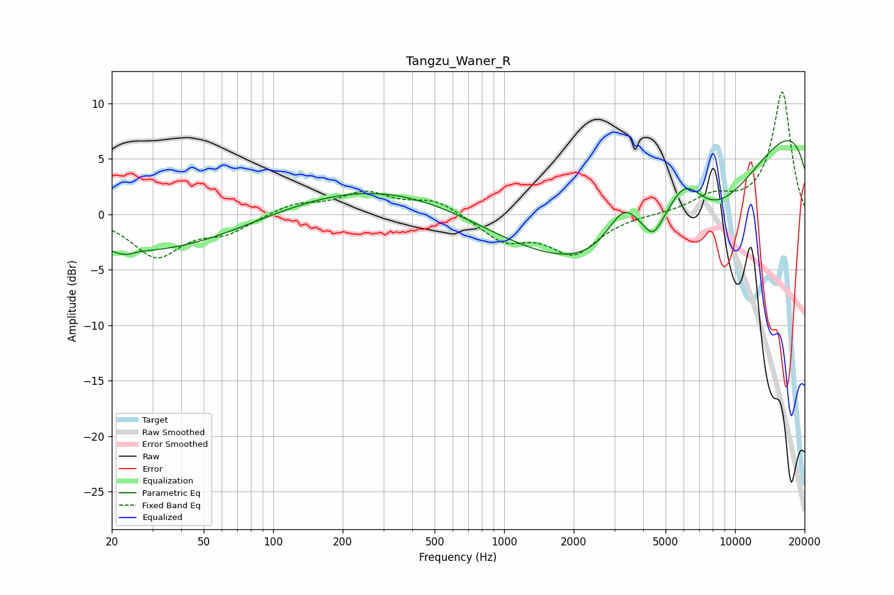

# Tangzu_Waner_R
See [usage instructions](https://github.com/jaakkopasanen/AutoEq#usage) for more options and info.

### Parametric EQs
Apply preamp of -6.7 dB when using parametric equalizer.

|   # | Type    |   Fc (Hz) |    Q |   Gain (dB) |
|-----|---------|-----------|------|-------------|
|   1 | Peaking |        21 | 5.48 |        -0.2 |
|   2 | Peaking |        23 | 4.93 |        -0.3 |
|   3 | Peaking |        28 | 0.36 |        -3.4 |
|   4 | Peaking |       306 | 0.35 |         2.8 |
|   5 | Peaking |      3324 | 1.7  |         4.9 |
|   6 | Peaking |      4414 | 3.99 |        -1.3 |
|   7 | Peaking |      4477 | 0.21 |        -8.9 |
|   8 | Peaking |      5996 | 1.35 |         7.1 |
|   9 | Peaking |      6164 | 0.41 |       -10.9 |
|  10 | Peaking |     10000 | 0.21 |        15.8 |

### Fixed Band EQs
When using fixed band (also called graphic) equalizer, apply preamp of **-11.1 dB** (if available) and set gains manually with these parameters.

|   # | Type    |   Fc (Hz) |    Q |   Gain (dB) |
|-----|---------|-----------|------|-------------|
|   1 | Peaking |        31 | 1.41 |        -3.7 |
|   2 | Peaking |        62 | 1.41 |        -1.4 |
|   3 | Peaking |       125 | 1.41 |         1   |
|   4 | Peaking |       250 | 1.41 |         1.9 |
|   5 | Peaking |       500 | 1.41 |         1.3 |
|   6 | Peaking |      1000 | 1.41 |        -2.2 |
|   7 | Peaking |      2000 | 1.41 |        -3.4 |
|   8 | Peaking |      4000 | 1.41 |         0   |
|   9 | Peaking |      8000 | 1.41 |         1.5 |
|  10 | Peaking |     16000 | 1.41 |        11   |

### Graphs

