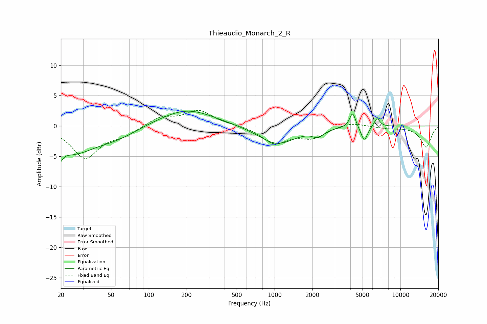

# Thieaudio_Monarch_2_R
See [usage instructions](https://github.com/jaakkopasanen/AutoEq#usage) for more options and info.

### Parametric EQs
Apply preamp of -2.5 dB when using parametric equalizer.

|   # | Type    |   Fc (Hz) |    Q |   Gain (dB) |
|-----|---------|-----------|------|-------------|
|   1 | Peaking |        20 | 5.83 |        -5.1 |
|   2 | Peaking |        20 | 5.94 |         3.2 |
|   3 | Peaking |        25 | 0.77 |        -4.2 |
|   4 | Peaking |        57 | 0.91 |        -1.4 |
|   5 | Peaking |       201 | 0.67 |         2.8 |
|   6 | Peaking |      1044 | 0.99 |        -3   |
|   7 | Peaking |      2216 | 3.2  |        -1.2 |
|   8 | Peaking |      4172 | 6    |         2.5 |
|   9 | Peaking |      5159 | 5.38 |        -2.5 |
|  10 | Peaking |      6511 | 6    |         1.5 |

### Fixed Band EQs
When using fixed band (also called graphic) equalizer, apply preamp of **-2.7 dB** (if available) and set gains manually with these parameters.

|   # | Type    |   Fc (Hz) |    Q |   Gain (dB) |
|-----|---------|-----------|------|-------------|
|   1 | Peaking |        31 | 1.41 |        -5.2 |
|   2 | Peaking |        62 | 1.41 |        -1.3 |
|   3 | Peaking |       125 | 1.41 |         1.5 |
|   4 | Peaking |       250 | 1.41 |         2.5 |
|   5 | Peaking |       500 | 1.41 |         0.2 |
|   6 | Peaking |      1000 | 1.41 |        -2.8 |
|   7 | Peaking |      2000 | 1.41 |        -1.8 |
|   8 | Peaking |      4000 | 1.41 |         0.7 |
|   9 | Peaking |      8000 | 1.41 |        -0.3 |
|  10 | Peaking |     16000 | 1.41 |        -3.5 |

### Graphs

