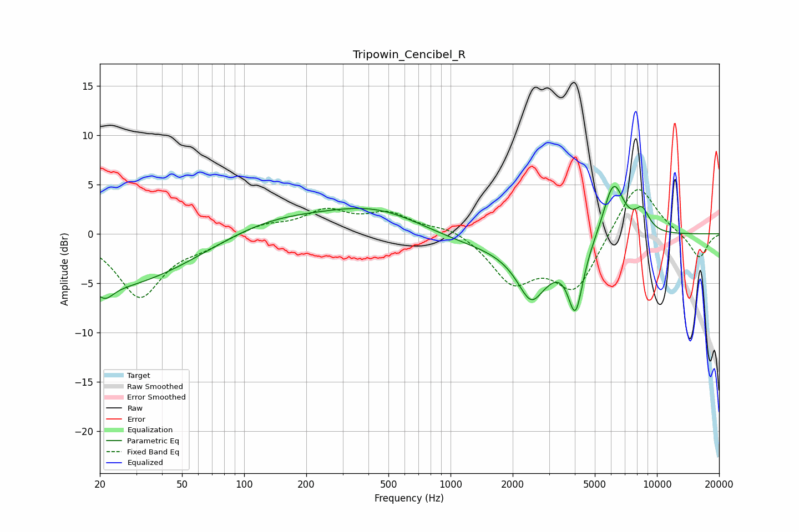

# Tripowin_Cencibel_R
See [usage instructions](https://github.com/jaakkopasanen/AutoEq#usage) for more options and info.

### Parametric EQs
Apply preamp of -4.9 dB when using parametric equalizer.

|   # | Type    |   Fc (Hz) |    Q |   Gain (dB) |
|-----|---------|-----------|------|-------------|
|   1 | Peaking |        21 | 3.74 |        -1.2 |
|   2 | Peaking |        21 | 0.33 |        -5.6 |
|   3 | Peaking |       131 | 0.52 |         1.8 |
|   4 | Peaking |       452 | 0.57 |         3.3 |
|   5 | Peaking |      1350 | 0.26 |        -1.8 |
|   6 | Peaking |      2508 | 1.99 |        -5.7 |
|   7 | Peaking |      2672 | 3.72 |         0.6 |
|   8 | Peaking |      4029 | 3.84 |        -6.5 |
|   9 | Peaking |      6157 | 2.63 |         6   |
|  10 | Peaking |      8471 | 3.59 |         2.2 |

### Fixed Band EQs
When using fixed band (also called graphic) equalizer, apply preamp of **-4.6 dB** (if available) and set gains manually with these parameters.

|   # | Type    |   Fc (Hz) |    Q |   Gain (dB) |
|-----|---------|-----------|------|-------------|
|   1 | Peaking |        31 | 1.41 |        -6.3 |
|   2 | Peaking |        62 | 1.41 |        -1   |
|   3 | Peaking |       125 | 1.41 |         0.9 |
|   4 | Peaking |       250 | 1.41 |         2.2 |
|   5 | Peaking |       500 | 1.41 |         1.9 |
|   6 | Peaking |      1000 | 1.41 |         0.8 |
|   7 | Peaking |      2000 | 1.41 |        -4.6 |
|   8 | Peaking |      4000 | 1.41 |        -5.6 |
|   9 | Peaking |      8000 | 1.41 |         5.5 |
|  10 | Peaking |     16000 | 1.41 |        -2.6 |

### Graphs

