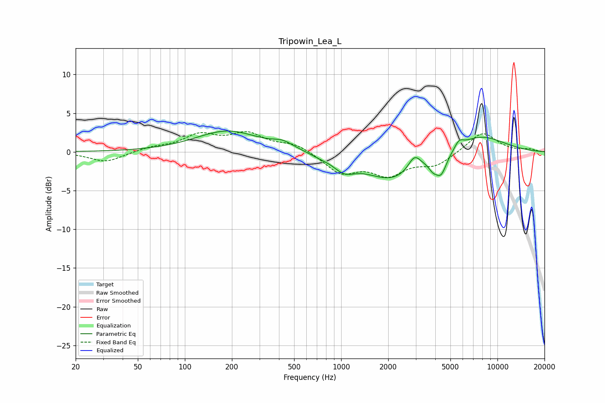

# Tripowin_Lea_L
See [usage instructions](https://github.com/jaakkopasanen/AutoEq#usage) for more options and info.

### Parametric EQs
Apply preamp of -2.8 dB when using parametric equalizer.

|   # | Type    |   Fc (Hz) |    Q |   Gain (dB) |
|-----|---------|-----------|------|-------------|
|   1 | Peaking |       187 | 0.7  |         2.7 |
|   2 | Peaking |       424 | 2.16 |         0.8 |
|   3 | Peaking |       731 | 2.44 |        -0.3 |
|   4 | Peaking |      1044 | 2.03 |        -1.6 |
|   5 | Peaking |      2142 | 0.79 |        -3.6 |
|   6 | Peaking |      2946 | 3.5  |         1.9 |
|   7 | Peaking |      3855 | 5.3  |        -0.9 |
|   8 | Peaking |      4354 | 3.81 |        -2.6 |
|   9 | Peaking |      5674 | 5.07 |         0.9 |
|  10 | Peaking |      7613 | 0.8  |         2.3 |

### Fixed Band EQs
When using fixed band (also called graphic) equalizer, apply preamp of **-2.7 dB** (if available) and set gains manually with these parameters.

|   # | Type    |   Fc (Hz) |    Q |   Gain (dB) |
|-----|---------|-----------|------|-------------|
|   1 | Peaking |        31 | 1.41 |        -1.3 |
|   2 | Peaking |        62 | 1.41 |         0.5 |
|   3 | Peaking |       125 | 1.41 |         2   |
|   4 | Peaking |       250 | 1.41 |         2.2 |
|   5 | Peaking |       500 | 1.41 |         1   |
|   6 | Peaking |      1000 | 1.41 |        -2.6 |
|   7 | Peaking |      2000 | 1.41 |        -2.7 |
|   8 | Peaking |      4000 | 1.41 |        -1.6 |
|   9 | Peaking |      8000 | 1.41 |         2.6 |
|  10 | Peaking |     16000 | 1.41 |         0.3 |

### Graphs

