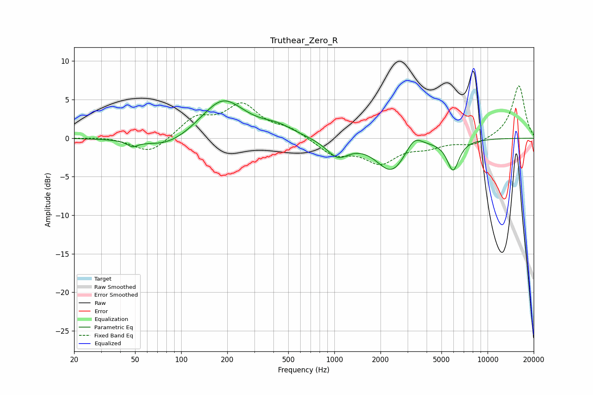

# Truthear_Zero_R
See [usage instructions](https://github.com/jaakkopasanen/AutoEq#usage) for more options and info.

### Parametric EQs
Apply preamp of -4.9 dB when using parametric equalizer.

|   # | Type    |   Fc (Hz) |    Q |   Gain (dB) |
|-----|---------|-----------|------|-------------|
|   1 | Peaking |        48 | 4.1  |        -0.7 |
|   2 | Peaking |        83 | 0.89 |        -1.6 |
|   3 | Peaking |       186 | 0.92 |         4.8 |
|   4 | Peaking |       188 | 1.76 |         0.4 |
|   5 | Peaking |       427 | 1.39 |         1   |
|   6 | Peaking |      1050 | 1.94 |        -2.3 |
|   7 | Peaking |      2344 | 2.46 |         0.3 |
|   8 | Peaking |      2366 | 1.49 |        -4.5 |
|   9 | Peaking |      3312 | 2.59 |         1.9 |
|  10 | Peaking |      5953 | 3.52 |        -3.9 |

### Fixed Band EQs
When using fixed band (also called graphic) equalizer, apply preamp of **-6.9 dB** (if available) and set gains manually with these parameters.

|   # | Type    |   Fc (Hz) |    Q |   Gain (dB) |
|-----|---------|-----------|------|-------------|
|   1 | Peaking |        31 | 1.41 |         0.2 |
|   2 | Peaking |        62 | 1.41 |        -2.1 |
|   3 | Peaking |       125 | 1.41 |         2.5 |
|   4 | Peaking |       250 | 1.41 |         4.1 |
|   5 | Peaking |       500 | 1.41 |         1.1 |
|   6 | Peaking |      1000 | 1.41 |        -2.1 |
|   7 | Peaking |      2000 | 1.41 |        -3   |
|   8 | Peaking |      4000 | 1.41 |        -1   |
|   9 | Peaking |      8000 | 1.41 |        -0.9 |
|  10 | Peaking |     16000 | 1.41 |         6.9 |

### Graphs

