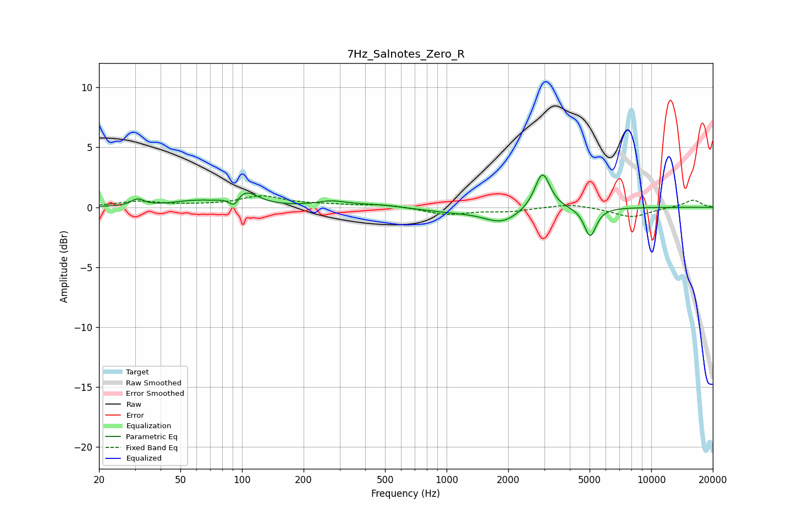

# 7Hz_Salnotes_Zero_R
See [usage instructions](https://github.com/jaakkopasanen/AutoEq#usage) for more options and info.

### Parametric EQs
Apply preamp of -2.8 dB when using parametric equalizer.

|   # | Type    |   Fc (Hz) |    Q |   Gain (dB) |
|-----|---------|-----------|------|-------------|
|   1 | Peaking |        31 | 4.68 |         0.6 |
|   2 | Peaking |        58 | 1.34 |         0.4 |
|   3 | Peaking |        91 | 6    |        -1   |
|   4 | Peaking |       102 | 2.28 |         1.3 |
|   5 | Peaking |       273 | 1.98 |         0.4 |
|   6 | Peaking |       453 | 1.14 |         0.2 |
|   7 | Peaking |      1046 | 0.88 |        -0.3 |
|   8 | Peaking |      1862 | 1.66 |        -1.2 |
|   9 | Peaking |      2941 | 3.8  |         3.2 |
|  10 | Peaking |      5033 | 4.81 |        -2.4 |

### Fixed Band EQs
When using fixed band (also called graphic) equalizer, apply preamp of **-1.1 dB** (if available) and set gains manually with these parameters.

|   # | Type    |   Fc (Hz) |    Q |   Gain (dB) |
|-----|---------|-----------|------|-------------|
|   1 | Peaking |        31 | 1.41 |         0.5 |
|   2 | Peaking |        62 | 1.41 |         0.1 |
|   3 | Peaking |       125 | 1.41 |         0.9 |
|   4 | Peaking |       250 | 1.41 |         0.2 |
|   5 | Peaking |       500 | 1.41 |         0.2 |
|   6 | Peaking |      1000 | 1.41 |        -0.6 |
|   7 | Peaking |      2000 | 1.41 |        -0.3 |
|   8 | Peaking |      4000 | 1.41 |         0.3 |
|   9 | Peaking |      8000 | 1.41 |        -0.8 |
|  10 | Peaking |     16000 | 1.41 |         0.6 |

### Graphs

