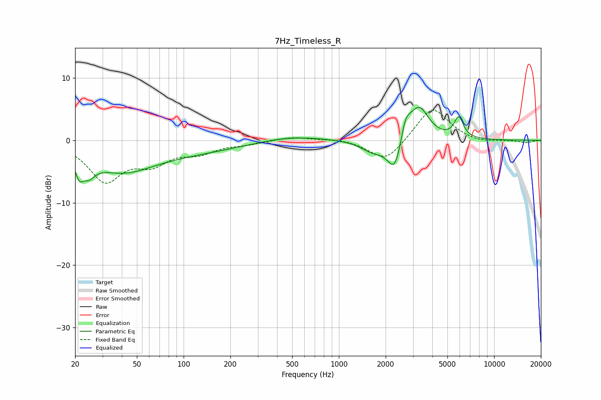

# 7Hz_Timeless_R
See [usage instructions](https://github.com/jaakkopasanen/AutoEq#usage) for more options and info.

### Parametric EQs
Apply preamp of -5.4 dB when using parametric equalizer.

|   # | Type    |   Fc (Hz) |    Q |   Gain (dB) |
|-----|---------|-----------|------|-------------|
|   1 | Peaking |        21 | 5.78 |        -2.5 |
|   2 | Peaking |        24 | 3.26 |        -2.6 |
|   3 | Peaking |        39 | 0.71 |        -3.9 |
|   4 | Peaking |       102 | 0.36 |        -1.8 |
|   5 | Peaking |       469 | 0.65 |         0.9 |
|   6 | Peaking |      1652 | 1.81 |        -1.7 |
|   7 | Peaking |      2305 | 2.93 |        -5.8 |
|   8 | Peaking |      2682 | 4.21 |         3.6 |
|   9 | Peaking |      3275 | 2.18 |         5.5 |
|  10 | Peaking |      5917 | 4.71 |         3.3 |

### Fixed Band EQs
When using fixed band (also called graphic) equalizer, apply preamp of **-4.9 dB** (if available) and set gains manually with these parameters.

|   # | Type    |   Fc (Hz) |    Q |   Gain (dB) |
|-----|---------|-----------|------|-------------|
|   1 | Peaking |        31 | 1.41 |        -6.2 |
|   2 | Peaking |        62 | 1.41 |        -3.1 |
|   3 | Peaking |       125 | 1.41 |        -1.7 |
|   4 | Peaking |       250 | 1.41 |        -0.5 |
|   5 | Peaking |       500 | 1.41 |         0.6 |
|   6 | Peaking |      1000 | 1.41 |         0.3 |
|   7 | Peaking |      2000 | 1.41 |        -3.5 |
|   8 | Peaking |      4000 | 1.41 |         5.5 |
|   9 | Peaking |      8000 | 1.41 |        -0.5 |
|  10 | Peaking |     16000 | 1.41 |        -0.4 |

### Graphs

