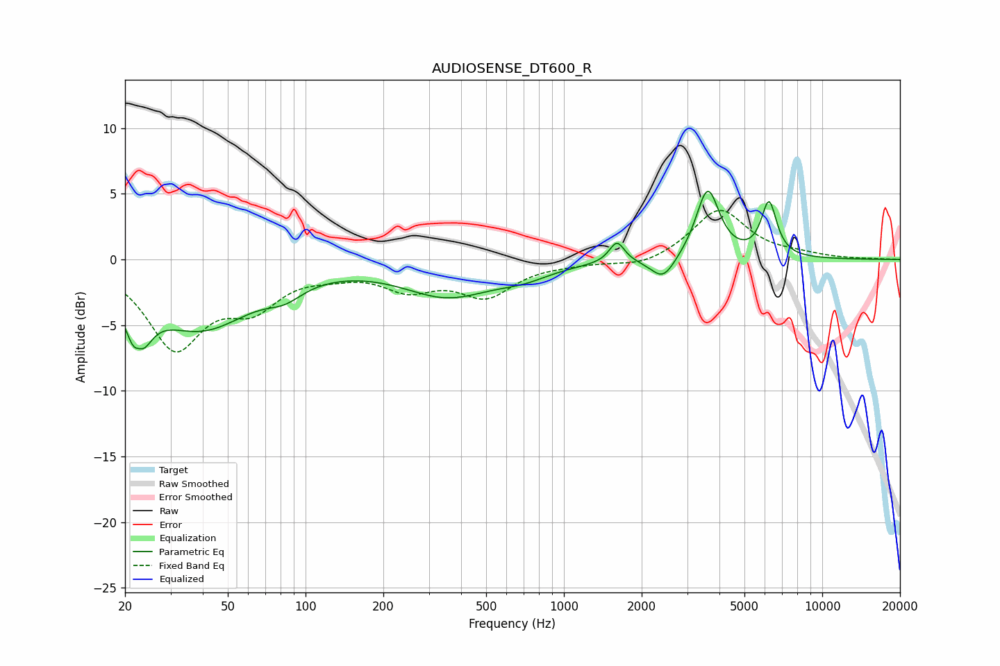

# AUDIOSENSE_DT600_R
See [usage instructions](https://github.com/jaakkopasanen/AutoEq#usage) for more options and info.

### Parametric EQs
Apply preamp of -5.3 dB when using parametric equalizer.

|   # | Type    |   Fc (Hz) |    Q |   Gain (dB) |
|-----|---------|-----------|------|-------------|
|   1 | Peaking |        22 | 3.93 |        -6.8 |
|   2 | Peaking |        23 | 5.99 |         3.1 |
|   3 | Peaking |        39 | 0.7  |        -5.1 |
|   4 | Peaking |        83 | 2.07 |        -1   |
|   5 | Peaking |       354 | 0.81 |        -2.6 |
|   6 | Peaking |       698 | 1.32 |        -0.8 |
|   7 | Peaking |      1604 | 4.87 |         1.6 |
|   8 | Peaking |      2424 | 2.95 |        -1.8 |
|   9 | Peaking |      3603 | 3.16 |         5.4 |
|  10 | Peaking |      6220 | 4.63 |         4.1 |

### Fixed Band EQs
When using fixed band (also called graphic) equalizer, apply preamp of **-3.8 dB** (if available) and set gains manually with these parameters.

|   # | Type    |   Fc (Hz) |    Q |   Gain (dB) |
|-----|---------|-----------|------|-------------|
|   1 | Peaking |        31 | 1.41 |        -6.4 |
|   2 | Peaking |        62 | 1.41 |        -3   |
|   3 | Peaking |       125 | 1.41 |        -0.7 |
|   4 | Peaking |       250 | 1.41 |        -1.9 |
|   5 | Peaking |       500 | 1.41 |        -2.6 |
|   6 | Peaking |      1000 | 1.41 |        -0.2 |
|   7 | Peaking |      2000 | 1.41 |        -0.6 |
|   8 | Peaking |      4000 | 1.41 |         3.8 |
|   9 | Peaking |      8000 | 1.41 |         0.3 |
|  10 | Peaking |     16000 | 1.41 |         0   |

### Graphs

