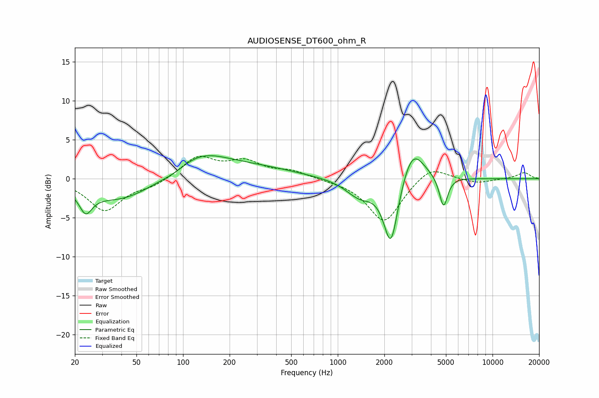

# AUDIOSENSE_DT600_ohm_R
See [usage instructions](https://github.com/jaakkopasanen/AutoEq#usage) for more options and info.

### Parametric EQs
Apply preamp of -3.1 dB when using parametric equalizer.

|   # | Type    |   Fc (Hz) |    Q |   Gain (dB) |
|-----|---------|-----------|------|-------------|
|   1 | Peaking |        23 | 3.73 |         1.8 |
|   2 | Peaking |        23 | 3.49 |        -4.5 |
|   3 | Peaking |        40 | 0.64 |        -3   |
|   4 | Peaking |        89 | 1.4  |        -1   |
|   5 | Peaking |       121 | 0.7  |         3.6 |
|   6 | Peaking |       329 | 0.58 |         1   |
|   7 | Peaking |      1382 | 1.58 |        -2.2 |
|   8 | Peaking |      2206 | 2.94 |        -8.9 |
|   9 | Peaking |      3033 | 1.87 |         4.7 |
|  10 | Peaking |      4824 | 5.23 |        -4   |

### Fixed Band EQs
When using fixed band (also called graphic) equalizer, apply preamp of **-3.0 dB** (if available) and set gains manually with these parameters.

|   # | Type    |   Fc (Hz) |    Q |   Gain (dB) |
|-----|---------|-----------|------|-------------|
|   1 | Peaking |        31 | 1.41 |        -4   |
|   2 | Peaking |        62 | 1.41 |        -0.8 |
|   3 | Peaking |       125 | 1.41 |         2.8 |
|   4 | Peaking |       250 | 1.41 |         2   |
|   5 | Peaking |       500 | 1.41 |         0.9 |
|   6 | Peaking |      1000 | 1.41 |        -0.1 |
|   7 | Peaking |      2000 | 1.41 |        -5.6 |
|   8 | Peaking |      4000 | 1.41 |         1.9 |
|   9 | Peaking |      8000 | 1.41 |        -0.6 |
|  10 | Peaking |     16000 | 1.41 |         0.8 |

### Graphs

