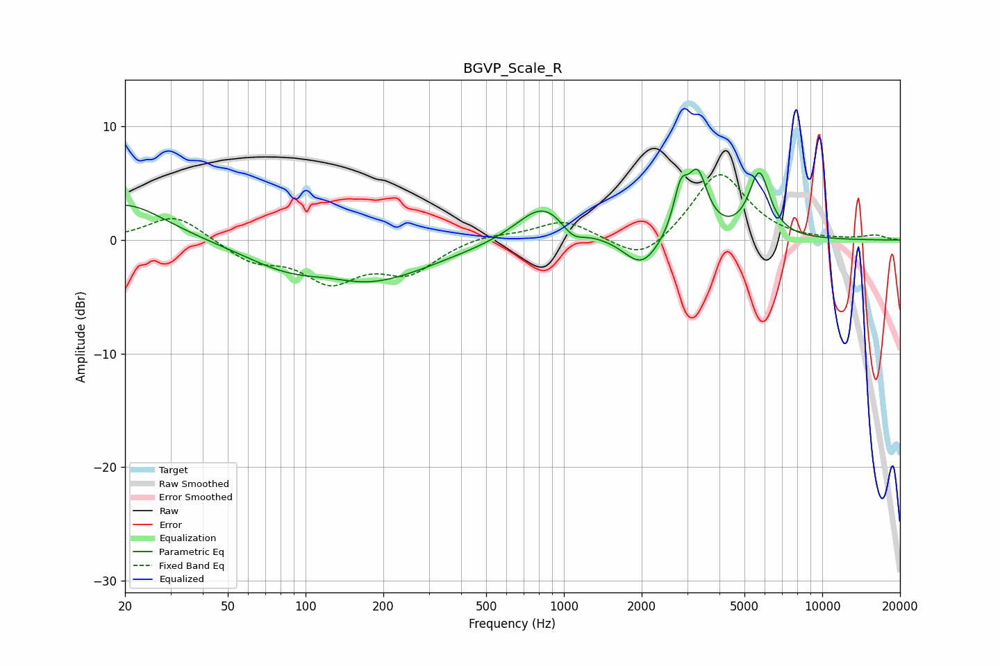

# BGVP_Scale_R
See [usage instructions](https://github.com/jaakkopasanen/AutoEq#usage) for more options and info.

### Parametric EQs
Apply preamp of -6.4 dB when using parametric equalizer.

|   # | Type    |   Fc (Hz) |    Q |   Gain (dB) |
|-----|---------|-----------|------|-------------|
|   1 | Peaking |        20 | 0.89 |         3.3 |
|   2 | Peaking |        80 | 0.96 |        -0.9 |
|   3 | Peaking |       126 | 1.34 |         0.6 |
|   4 | Peaking |       162 | 0.54 |        -3.9 |
|   5 | Peaking |       834 | 1.38 |         3.5 |
|   6 | Peaking |      1081 | 3.12 |        -1.3 |
|   7 | Peaking |      2001 | 2.07 |        -2.7 |
|   8 | Peaking |      2830 | 5.06 |         3.6 |
|   9 | Peaking |      3294 | 3.65 |         5.2 |
|  10 | Peaking |      5710 | 3.42 |         5.7 |

### Fixed Band EQs
When using fixed band (also called graphic) equalizer, apply preamp of **-5.9 dB** (if available) and set gains manually with these parameters.

|   # | Type    |   Fc (Hz) |    Q |   Gain (dB) |
|-----|---------|-----------|------|-------------|
|   1 | Peaking |        31 | 1.41 |         2.3 |
|   2 | Peaking |        62 | 1.41 |        -1.7 |
|   3 | Peaking |       125 | 1.41 |        -3.3 |
|   4 | Peaking |       250 | 1.41 |        -2.6 |
|   5 | Peaking |       500 | 1.41 |         0.5 |
|   6 | Peaking |      1000 | 1.41 |         1.7 |
|   7 | Peaking |      2000 | 1.41 |        -2.2 |
|   8 | Peaking |      4000 | 1.41 |         6.1 |
|   9 | Peaking |      8000 | 1.41 |        -0.1 |
|  10 | Peaking |     16000 | 1.41 |         0.4 |

### Graphs

