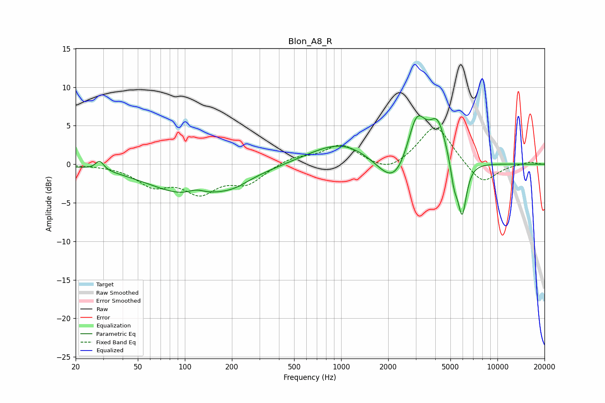

# Blon_A8_R
See [usage instructions](https://github.com/jaakkopasanen/AutoEq#usage) for more options and info.

### Parametric EQs
Apply preamp of -6.4 dB when using parametric equalizer.

|   # | Type    |   Fc (Hz) |    Q |   Gain (dB) |
|-----|---------|-----------|------|-------------|
|   1 | Peaking |        28 | 5.49 |         1.2 |
|   2 | Peaking |       115 | 0.53 |        -4.2 |
|   3 | Peaking |       118 | 2.38 |         0.9 |
|   4 | Peaking |       209 | 1.74 |        -0.5 |
|   5 | Peaking |      1014 | 0.68 |         3   |
|   6 | Peaking |      2212 | 1.31 |        -4.5 |
|   7 | Peaking |      3040 | 2.26 |         6.9 |
|   8 | Peaking |      4150 | 2.6  |         4.9 |
|   9 | Peaking |      5285 | 5.98 |        -2.9 |
|  10 | Peaking |      5946 | 4.89 |        -7   |

### Fixed Band EQs
When using fixed band (also called graphic) equalizer, apply preamp of **-4.8 dB** (if available) and set gains manually with these parameters.

|   # | Type    |   Fc (Hz) |    Q |   Gain (dB) |
|-----|---------|-----------|------|-------------|
|   1 | Peaking |        31 | 1.41 |        -0   |
|   2 | Peaking |        62 | 1.41 |        -2.5 |
|   3 | Peaking |       125 | 1.41 |        -3.3 |
|   4 | Peaking |       250 | 1.41 |        -2.3 |
|   5 | Peaking |       500 | 1.41 |         0.9 |
|   6 | Peaking |      1000 | 1.41 |         2.5 |
|   7 | Peaking |      2000 | 1.41 |        -1.3 |
|   8 | Peaking |      4000 | 1.41 |         5.2 |
|   9 | Peaking |      8000 | 1.41 |        -2.8 |
|  10 | Peaking |     16000 | 1.41 |         0.3 |

### Graphs

