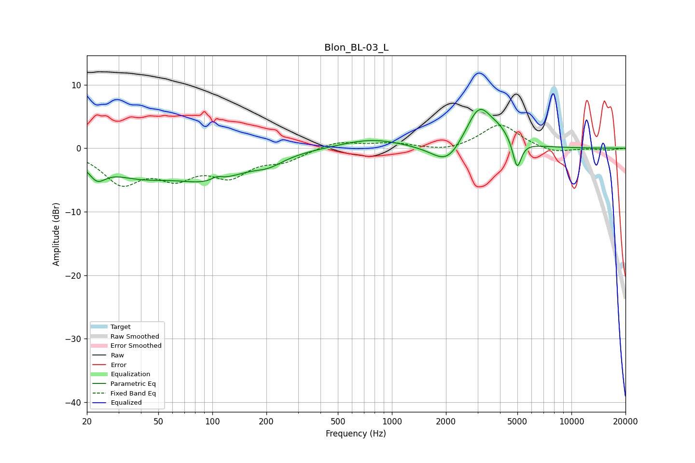

# Blon_BL-03_L
See [usage instructions](https://github.com/jaakkopasanen/AutoEq#usage) for more options and info.

### Parametric EQs
Apply preamp of -6.2 dB when using parametric equalizer.

|   # | Type    |   Fc (Hz) |    Q |   Gain (dB) |
|-----|---------|-----------|------|-------------|
|   1 | Peaking |        23 | 2.94 |        -2.6 |
|   2 | Peaking |        38 | 0.73 |        -3.4 |
|   3 | Peaking |        98 | 0.7  |        -4.2 |
|   4 | Peaking |       106 | 4.66 |         0.6 |
|   5 | Peaking |       207 | 1.76 |        -1.2 |
|   6 | Peaking |       767 | 0.83 |         1.5 |
|   7 | Peaking |      2040 | 1.65 |        -3.5 |
|   8 | Peaking |      3061 | 1.82 |         6.9 |
|   9 | Peaking |      4031 | 2.62 |         1.2 |
|  10 | Peaking |      4981 | 6    |        -4.5 |

### Fixed Band EQs
When using fixed band (also called graphic) equalizer, apply preamp of **-3.7 dB** (if available) and set gains manually with these parameters.

|   # | Type    |   Fc (Hz) |    Q |   Gain (dB) |
|-----|---------|-----------|------|-------------|
|   1 | Peaking |        31 | 1.41 |        -5.1 |
|   2 | Peaking |        62 | 1.41 |        -3.8 |
|   3 | Peaking |       125 | 1.41 |        -3.8 |
|   4 | Peaking |       250 | 1.41 |        -1.7 |
|   5 | Peaking |       500 | 1.41 |         1.2 |
|   6 | Peaking |      1000 | 1.41 |         0.8 |
|   7 | Peaking |      2000 | 1.41 |        -0.6 |
|   8 | Peaking |      4000 | 1.41 |         3.8 |
|   9 | Peaking |      8000 | 1.41 |        -0.8 |
|  10 | Peaking |     16000 | 1.41 |        -0.3 |

### Graphs

