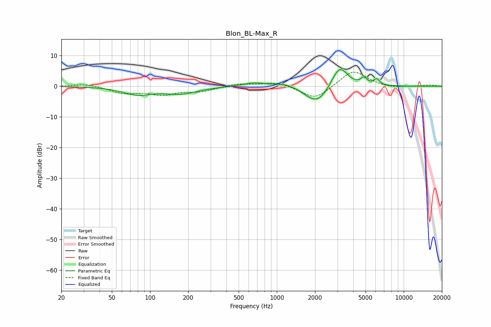

# Blon_BL-Max_R
See [usage instructions](https://github.com/jaakkopasanen/AutoEq#usage) for more options and info.

### Parametric EQs
Apply preamp of -5.6 dB when using parametric equalizer.

|   # | Type    |   Fc (Hz) |    Q |   Gain (dB) |
|-----|---------|-----------|------|-------------|
|   1 | Peaking |        79 | 1.27 |        -2.5 |
|   2 | Peaking |       174 | 1.07 |        -2.2 |
|   3 | Peaking |       661 | 1.53 |         1.2 |
|   4 | Peaking |      1158 | 1.7  |         1.1 |
|   5 | Peaking |      1832 | 1.98 |        -1.2 |
|   6 | Peaking |      2140 | 1.65 |        -4.9 |
|   7 | Peaking |      2997 | 2.59 |         1.7 |
|   8 | Peaking |      3162 | 2.27 |         5.7 |
|   9 | Peaking |      4868 | 5.87 |         2.1 |
|  10 | Peaking |      6119 | 6    |         2   |

### Fixed Band EQs
When using fixed band (also called graphic) equalizer, apply preamp of **-4.7 dB** (if available) and set gains manually with these parameters.

|   # | Type    |   Fc (Hz) |    Q |   Gain (dB) |
|-----|---------|-----------|------|-------------|
|   1 | Peaking |        31 | 1.41 |         0.9 |
|   2 | Peaking |        62 | 1.41 |        -2.1 |
|   3 | Peaking |       125 | 1.41 |        -2.4 |
|   4 | Peaking |       250 | 1.41 |        -1.5 |
|   5 | Peaking |       500 | 1.41 |         0.9 |
|   6 | Peaking |      1000 | 1.41 |         1.4 |
|   7 | Peaking |      2000 | 1.41 |        -4.4 |
|   8 | Peaking |      4000 | 1.41 |         5.4 |
|   9 | Peaking |      8000 | 1.41 |        -0.7 |
|  10 | Peaking |     16000 | 1.41 |         0.4 |

### Graphs

