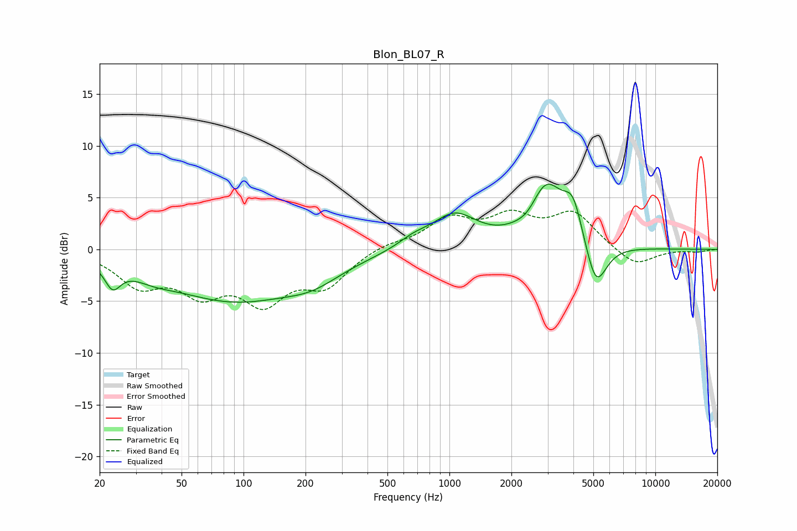

# Blon_BL07_R
See [usage instructions](https://github.com/jaakkopasanen/AutoEq#usage) for more options and info.

### Parametric EQs
Apply preamp of -6.4 dB when using parametric equalizer.

|   # | Type    |   Fc (Hz) |    Q |   Gain (dB) |
|-----|---------|-----------|------|-------------|
|   1 | Peaking |        23 | 3.75 |        -2.2 |
|   2 | Peaking |        36 | 1.43 |        -0.7 |
|   3 | Peaking |        89 | 0.43 |        -4.8 |
|   4 | Peaking |       217 | 1.04 |        -1.4 |
|   5 | Peaking |       669 | 1.86 |         0.8 |
|   6 | Peaking |      1058 | 1.29 |         3.2 |
|   7 | Peaking |      2432 | 2.48 |        -1   |
|   8 | Peaking |      2941 | 1.61 |         6.1 |
|   9 | Peaking |      3988 | 3.05 |         3.5 |
|  10 | Peaking |      5145 | 2.66 |        -4.7 |

### Fixed Band EQs
When using fixed band (also called graphic) equalizer, apply preamp of **-3.9 dB** (if available) and set gains manually with these parameters.

|   # | Type    |   Fc (Hz) |    Q |   Gain (dB) |
|-----|---------|-----------|------|-------------|
|   1 | Peaking |        31 | 1.41 |        -3.1 |
|   2 | Peaking |        62 | 1.41 |        -3.6 |
|   3 | Peaking |       125 | 1.41 |        -4.5 |
|   4 | Peaking |       250 | 1.41 |        -3.2 |
|   5 | Peaking |       500 | 1.41 |         0.6 |
|   6 | Peaking |      1000 | 1.41 |         2.7 |
|   7 | Peaking |      2000 | 1.41 |         2.8 |
|   8 | Peaking |      4000 | 1.41 |         3.3 |
|   9 | Peaking |      8000 | 1.41 |        -1.7 |
|  10 | Peaking |     16000 | 1.41 |        -0.2 |

### Graphs

