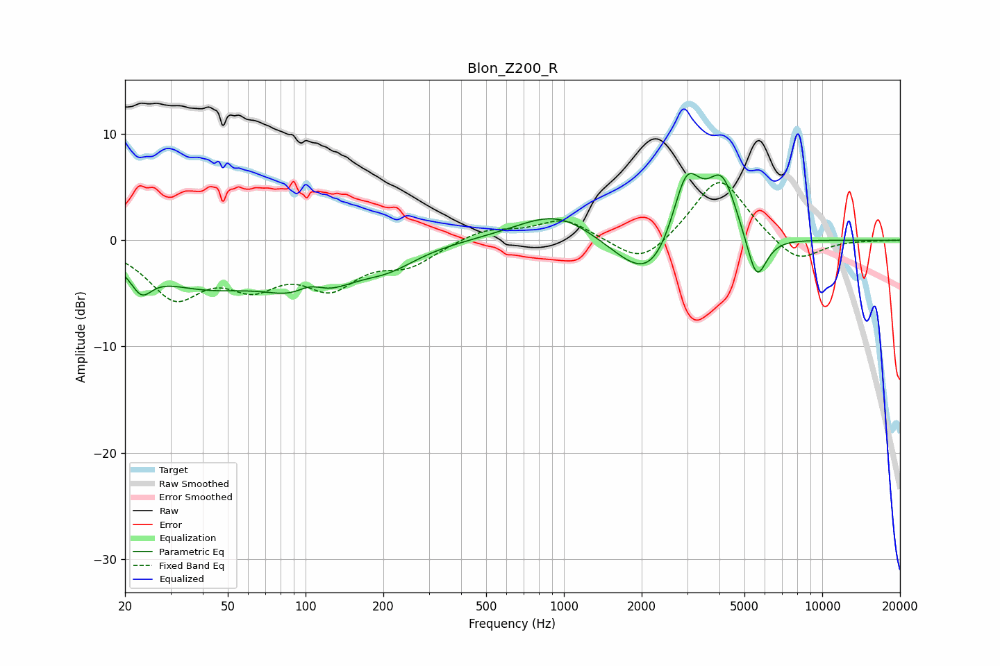

# Blon_Z200_R
See [usage instructions](https://github.com/jaakkopasanen/AutoEq#usage) for more options and info.

### Parametric EQs
Apply preamp of -6.4 dB when using parametric equalizer.

|   # | Type    |   Fc (Hz) |    Q |   Gain (dB) |
|-----|---------|-----------|------|-------------|
|   1 | Peaking |        23 | 3.5  |        -2.3 |
|   2 | Peaking |        40 | 0.6  |        -3.8 |
|   3 | Peaking |       104 | 2.18 |         2.4 |
|   4 | Peaking |       105 | 1.09 |        -5.1 |
|   5 | Peaking |       209 | 1.24 |        -1.6 |
|   6 | Peaking |       947 | 0.9  |         2.9 |
|   7 | Peaking |      2211 | 1.07 |        -5.5 |
|   8 | Peaking |      2977 | 2.3  |         8   |
|   9 | Peaking |      4102 | 2.37 |         5.9 |
|  10 | Peaking |      5570 | 3.53 |        -4.6 |

### Fixed Band EQs
When using fixed band (also called graphic) equalizer, apply preamp of **-5.5 dB** (if available) and set gains manually with these parameters.

|   # | Type    |   Fc (Hz) |    Q |   Gain (dB) |
|-----|---------|-----------|------|-------------|
|   1 | Peaking |        31 | 1.41 |        -5   |
|   2 | Peaking |        62 | 1.41 |        -3.4 |
|   3 | Peaking |       125 | 1.41 |        -3.8 |
|   4 | Peaking |       250 | 1.41 |        -2   |
|   5 | Peaking |       500 | 1.41 |         1.1 |
|   6 | Peaking |      1000 | 1.41 |         2   |
|   7 | Peaking |      2000 | 1.41 |        -2.6 |
|   8 | Peaking |      4000 | 1.41 |         6.1 |
|   9 | Peaking |      8000 | 1.41 |        -2.3 |
|  10 | Peaking |     16000 | 1.41 |        -0   |

### Graphs

