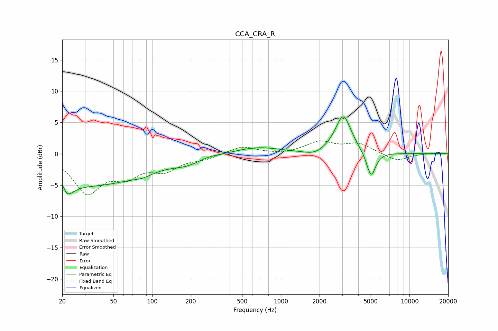

# CCA_CRA_R
See [usage instructions](https://github.com/jaakkopasanen/AutoEq#usage) for more options and info.

### Parametric EQs
Apply preamp of -6.0 dB when using parametric equalizer.

|   # | Type    |   Fc (Hz) |    Q |   Gain (dB) |
|-----|---------|-----------|------|-------------|
|   1 | Peaking |        20 | 5.92 |         3.3 |
|   2 | Peaking |        20 | 2.6  |        -4.4 |
|   3 | Peaking |        36 | 0.36 |        -4.8 |
|   4 | Peaking |        85 | 2.07 |        -0.5 |
|   5 | Peaking |       188 | 1.28 |        -1   |
|   6 | Peaking |       270 | 1.81 |         0.3 |
|   7 | Peaking |       657 | 0.82 |         1.1 |
|   8 | Peaking |      1821 | 1.88 |        -0.7 |
|   9 | Peaking |      3054 | 2.27 |         6.2 |
|  10 | Peaking |      5029 | 3.91 |        -4.2 |

### Fixed Band EQs
When using fixed band (also called graphic) equalizer, apply preamp of **-2.2 dB** (if available) and set gains manually with these parameters.

|   # | Type    |   Fc (Hz) |    Q |   Gain (dB) |
|-----|---------|-----------|------|-------------|
|   1 | Peaking |        31 | 1.41 |        -5.9 |
|   2 | Peaking |        62 | 1.41 |        -2.9 |
|   3 | Peaking |       125 | 1.41 |        -2.3 |
|   4 | Peaking |       250 | 1.41 |        -0.7 |
|   5 | Peaking |       500 | 1.41 |         1.2 |
|   6 | Peaking |      1000 | 1.41 |        -0.1 |
|   7 | Peaking |      2000 | 1.41 |         1.8 |
|   8 | Peaking |      4000 | 1.41 |         1.6 |
|   9 | Peaking |      8000 | 1.41 |        -1.2 |
|  10 | Peaking |     16000 | 1.41 |         0.1 |

### Graphs

