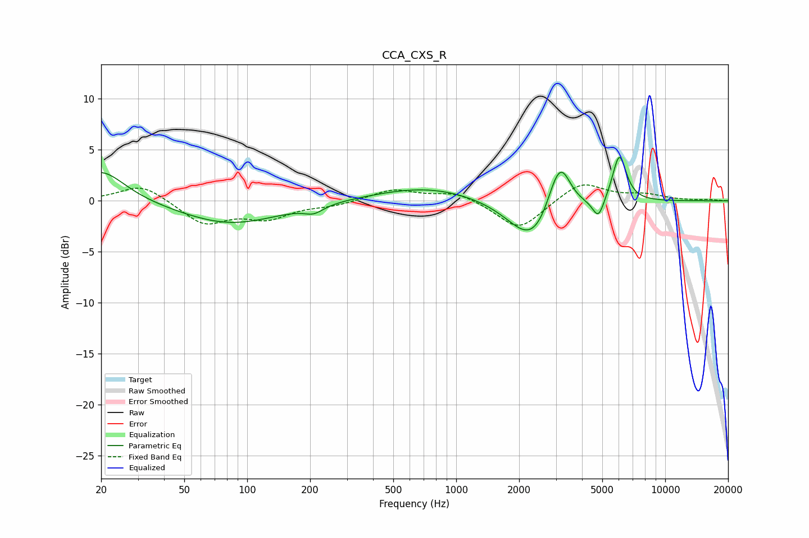

# CCA_CXS_R
See [usage instructions](https://github.com/jaakkopasanen/AutoEq#usage) for more options and info.

### Parametric EQs
Apply preamp of -4.3 dB when using parametric equalizer.

|   # | Type    |   Fc (Hz) |    Q |   Gain (dB) |
|-----|---------|-----------|------|-------------|
|   1 | Peaking |        20 | 1.25 |         3.1 |
|   2 | Peaking |        83 | 0.6  |        -2.3 |
|   3 | Peaking |       208 | 3.11 |        -0.7 |
|   4 | Peaking |       729 | 0.57 |         1.4 |
|   5 | Peaking |      2294 | 1.29 |        -3.4 |
|   6 | Peaking |      2513 | 1.13 |        -1   |
|   7 | Peaking |      2908 | 3.19 |         1.4 |
|   8 | Peaking |      3181 | 2.89 |         4.3 |
|   9 | Peaking |      4790 | 5.07 |        -2   |
|  10 | Peaking |      6037 | 4.12 |         4.7 |

### Fixed Band EQs
When using fixed band (also called graphic) equalizer, apply preamp of **-1.7 dB** (if available) and set gains manually with these parameters.

|   # | Type    |   Fc (Hz) |    Q |   Gain (dB) |
|-----|---------|-----------|------|-------------|
|   1 | Peaking |        31 | 1.41 |         1.7 |
|   2 | Peaking |        62 | 1.41 |        -2.3 |
|   3 | Peaking |       125 | 1.41 |        -1.6 |
|   4 | Peaking |       250 | 1.41 |        -0.4 |
|   5 | Peaking |       500 | 1.41 |         1.1 |
|   6 | Peaking |      1000 | 1.41 |         0.9 |
|   7 | Peaking |      2000 | 1.41 |        -2.9 |
|   8 | Peaking |      4000 | 1.41 |         1.9 |
|   9 | Peaking |      8000 | 1.41 |         0.5 |
|  10 | Peaking |     16000 | 1.41 |         0.1 |

### Graphs

