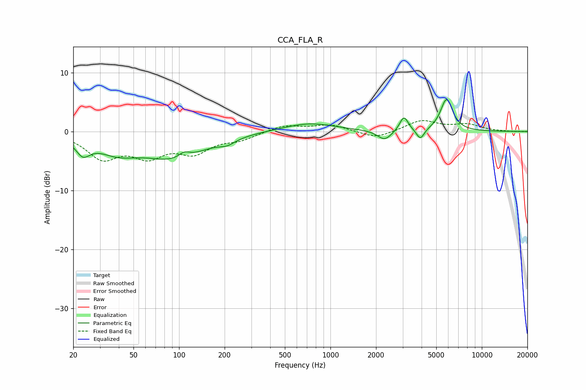

# CCA_FLA_R
See [usage instructions](https://github.com/jaakkopasanen/AutoEq#usage) for more options and info.

### Parametric EQs
Apply preamp of -5.5 dB when using parametric equalizer.

|   # | Type    |   Fc (Hz) |    Q |   Gain (dB) |
|-----|---------|-----------|------|-------------|
|   1 | Peaking |        23 | 3.04 |        -2.6 |
|   2 | Peaking |        39 | 1    |        -2.8 |
|   3 | Peaking |        95 | 0.7  |        -4.2 |
|   4 | Peaking |       108 | 3.8  |         1   |
|   5 | Peaking |       208 | 2.7  |        -0.8 |
|   6 | Peaking |       721 | 0.82 |         1.5 |
|   7 | Peaking |      2281 | 3.03 |        -1.7 |
|   8 | Peaking |      3058 | 5.07 |         2.6 |
|   9 | Peaking |      3928 | 5.53 |        -1.8 |
|  10 | Peaking |      5848 | 3.46 |         5.4 |

### Fixed Band EQs
When using fixed band (also called graphic) equalizer, apply preamp of **-1.9 dB** (if available) and set gains manually with these parameters.

|   # | Type    |   Fc (Hz) |    Q |   Gain (dB) |
|-----|---------|-----------|------|-------------|
|   1 | Peaking |        31 | 1.41 |        -4.2 |
|   2 | Peaking |        62 | 1.41 |        -3.6 |
|   3 | Peaking |       125 | 1.41 |        -3.2 |
|   4 | Peaking |       250 | 1.41 |        -1.2 |
|   5 | Peaking |       500 | 1.41 |         1.1 |
|   6 | Peaking |      1000 | 1.41 |         1.1 |
|   7 | Peaking |      2000 | 1.41 |        -1.3 |
|   8 | Peaking |      4000 | 1.41 |         1.9 |
|   9 | Peaking |      8000 | 1.41 |         1.1 |
|  10 | Peaking |     16000 | 1.41 |        -0   |

### Graphs

