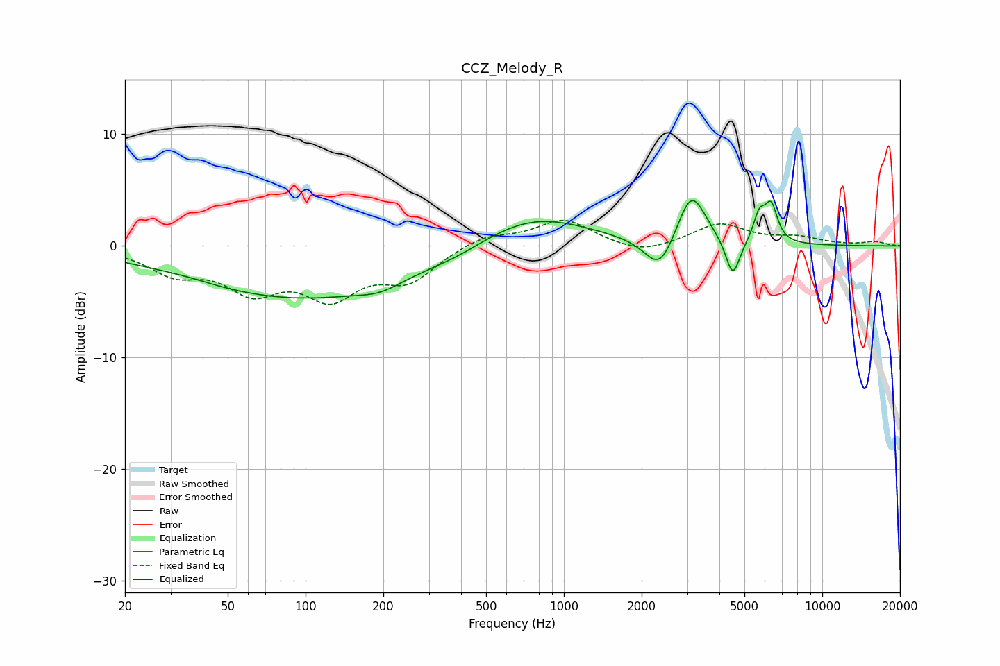

# CCZ_Melody_R
See [usage instructions](https://github.com/jaakkopasanen/AutoEq#usage) for more options and info.

### Parametric EQs
Apply preamp of -4.1 dB when using parametric equalizer.

|   # | Type    |   Fc (Hz) |    Q |   Gain (dB) |
|-----|---------|-----------|------|-------------|
|   1 | Peaking |        35 | 1.42 |         0.2 |
|   2 | Peaking |        98 | 0.31 |        -4.7 |
|   3 | Peaking |       193 | 1.81 |        -0.6 |
|   4 | Peaking |       393 | 1.52 |        -0.3 |
|   5 | Peaking |       754 | 0.66 |         3   |
|   6 | Peaking |      2352 | 2.45 |        -3.2 |
|   7 | Peaking |      3115 | 2.52 |         4.9 |
|   8 | Peaking |      4506 | 5.1  |        -3.5 |
|   9 | Peaking |      5712 | 6    |         2.4 |
|  10 | Peaking |      6347 | 5.72 |         3.2 |

### Fixed Band EQs
When using fixed band (also called graphic) equalizer, apply preamp of **-2.4 dB** (if available) and set gains manually with these parameters.

|   # | Type    |   Fc (Hz) |    Q |   Gain (dB) |
|-----|---------|-----------|------|-------------|
|   1 | Peaking |        31 | 1.41 |        -2.2 |
|   2 | Peaking |        62 | 1.41 |        -3.5 |
|   3 | Peaking |       125 | 1.41 |        -4.1 |
|   4 | Peaking |       250 | 1.41 |        -2.8 |
|   5 | Peaking |       500 | 1.41 |         1   |
|   6 | Peaking |      1000 | 1.41 |         2.3 |
|   7 | Peaking |      2000 | 1.41 |        -0.9 |
|   8 | Peaking |      4000 | 1.41 |         1.9 |
|   9 | Peaking |      8000 | 1.41 |         0.7 |
|  10 | Peaking |     16000 | 1.41 |         0.3 |

### Graphs

