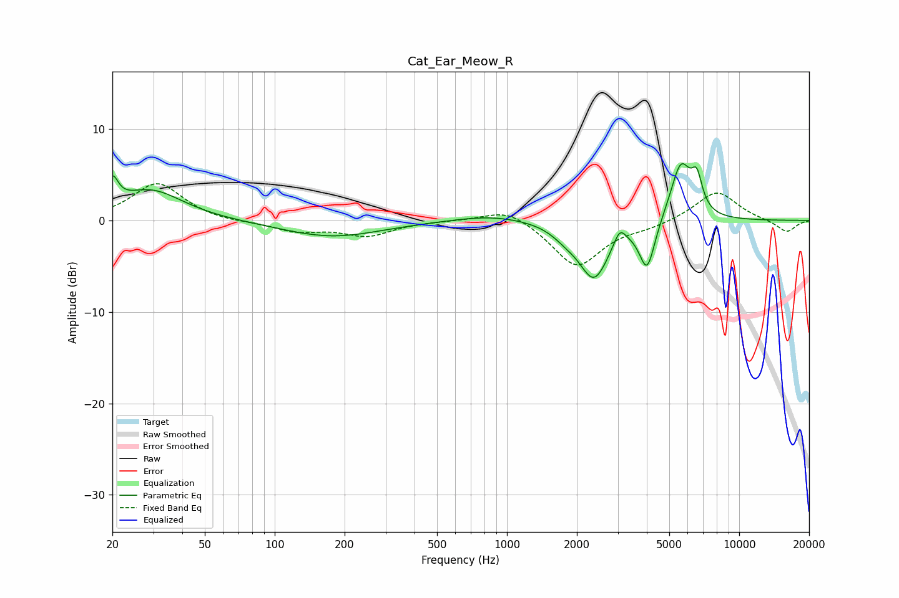

# Cat_Ear_Meow_R
See [usage instructions](https://github.com/jaakkopasanen/AutoEq#usage) for more options and info.

### Parametric EQs
Apply preamp of -6.3 dB when using parametric equalizer.

|   # | Type    |   Fc (Hz) |    Q |   Gain (dB) |
|-----|---------|-----------|------|-------------|
|   1 | Peaking |        20 | 5.91 |         2.9 |
|   2 | Peaking |        29 | 1.01 |         3.3 |
|   3 | Peaking |       176 | 0.66 |        -1.8 |
|   4 | Peaking |       859 | 0.89 |         0.7 |
|   5 | Peaking |      1795 | 2.42 |        -0.9 |
|   6 | Peaking |      2372 | 2.19 |        -6.1 |
|   7 | Peaking |      3062 | 5.67 |         1.7 |
|   8 | Peaking |      4016 | 4.18 |        -5.3 |
|   9 | Peaking |      5608 | 3.04 |         6.3 |
|  10 | Peaking |      6572 | 5.91 |         3.3 |

### Fixed Band EQs
When using fixed band (also called graphic) equalizer, apply preamp of **-4.1 dB** (if available) and set gains manually with these parameters.

|   # | Type    |   Fc (Hz) |    Q |   Gain (dB) |
|-----|---------|-----------|------|-------------|
|   1 | Peaking |        31 | 1.41 |         4.1 |
|   2 | Peaking |        62 | 1.41 |        -0.2 |
|   3 | Peaking |       125 | 1.41 |        -1.1 |
|   4 | Peaking |       250 | 1.41 |        -1.6 |
|   5 | Peaking |       500 | 1.41 |         0   |
|   6 | Peaking |      1000 | 1.41 |         1.5 |
|   7 | Peaking |      2000 | 1.41 |        -5.1 |
|   8 | Peaking |      4000 | 1.41 |        -0.6 |
|   9 | Peaking |      8000 | 1.41 |         3.3 |
|  10 | Peaking |     16000 | 1.41 |        -1.3 |

### Graphs

