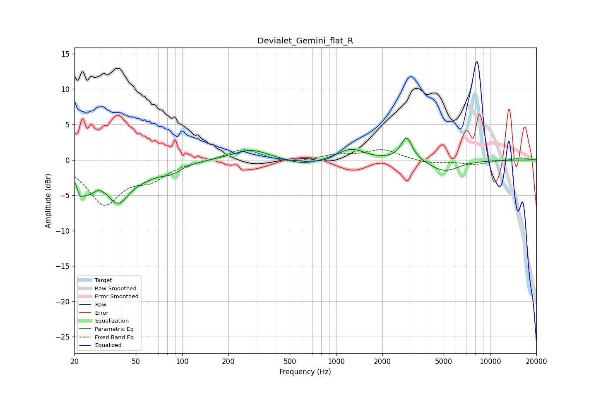

# Devialet_Gemini_flat_R
See [usage instructions](https://github.com/jaakkopasanen/AutoEq#usage) for more options and info.

### Parametric EQs
Apply preamp of -3.1 dB when using parametric equalizer.

|   # | Type    |   Fc (Hz) |    Q |   Gain (dB) |
|-----|---------|-----------|------|-------------|
|   1 | Peaking |        22 | 5.45 |        -2.9 |
|   2 | Peaking |        25 | 3.56 |        -2.2 |
|   3 | Peaking |        38 | 1.72 |        -5.5 |
|   4 | Peaking |        58 | 1.78 |        -1   |
|   5 | Peaking |        84 | 1.97 |        -1.3 |
|   6 | Peaking |       278 | 1.25 |         1.5 |
|   7 | Peaking |       615 | 1.35 |        -0.8 |
|   8 | Peaking |      1254 | 1.67 |         1.6 |
|   9 | Peaking |      2873 | 3.81 |         3.3 |
|  10 | Peaking |      5052 | 1.47 |        -1.6 |

### Fixed Band EQs
When using fixed band (also called graphic) equalizer, apply preamp of **-1.5 dB** (if available) and set gains manually with these parameters.

|   # | Type    |   Fc (Hz) |    Q |   Gain (dB) |
|-----|---------|-----------|------|-------------|
|   1 | Peaking |        31 | 1.41 |        -6   |
|   2 | Peaking |        62 | 1.41 |        -2.3 |
|   3 | Peaking |       125 | 1.41 |        -0.1 |
|   4 | Peaking |       250 | 1.41 |         1.6 |
|   5 | Peaking |       500 | 1.41 |        -0.6 |
|   6 | Peaking |      1000 | 1.41 |         0.6 |
|   7 | Peaking |      2000 | 1.41 |         1.4 |
|   8 | Peaking |      4000 | 1.41 |        -0.5 |
|   9 | Peaking |      8000 | 1.41 |        -0.6 |
|  10 | Peaking |     16000 | 1.41 |         0.3 |

### Graphs

