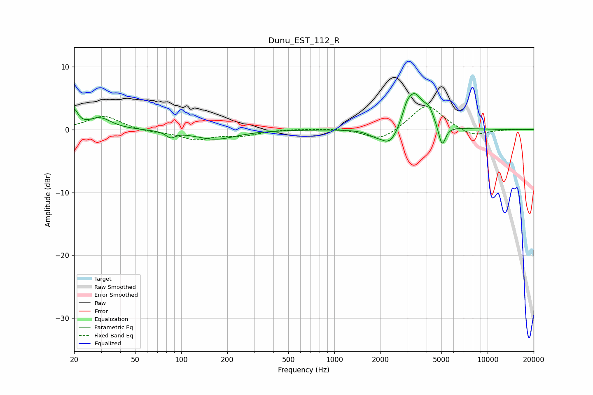

# Dunu_EST_112_R
See [usage instructions](https://github.com/jaakkopasanen/AutoEq#usage) for more options and info.

### Parametric EQs
Apply preamp of -5.8 dB when using parametric equalizer.

|   # | Type    |   Fc (Hz) |    Q |   Gain (dB) |
|-----|---------|-----------|------|-------------|
|   1 | Peaking |        20 | 5.65 |         2.7 |
|   2 | Peaking |        29 | 1.92 |         1.8 |
|   3 | Peaking |        85 | 4.83 |        -0.9 |
|   4 | Peaking |       167 | 1.04 |        -1.5 |
|   5 | Peaking |      1811 | 3.22 |        -0.5 |
|   6 | Peaking |      2312 | 2.31 |        -3.1 |
|   7 | Peaking |      2955 | 5.95 |         1.1 |
|   8 | Peaking |      3303 | 2.39 |         5.9 |
|   9 | Peaking |      4143 | 4.21 |         1.9 |
|  10 | Peaking |      5043 | 5.95 |        -3.5 |

### Fixed Band EQs
When using fixed band (also called graphic) equalizer, apply preamp of **-3.7 dB** (if available) and set gains manually with these parameters.

|   # | Type    |   Fc (Hz) |    Q |   Gain (dB) |
|-----|---------|-----------|------|-------------|
|   1 | Peaking |        31 | 1.41 |         2.2 |
|   2 | Peaking |        62 | 1.41 |        -0.4 |
|   3 | Peaking |       125 | 1.41 |        -1.5 |
|   4 | Peaking |       250 | 1.41 |        -0.8 |
|   5 | Peaking |       500 | 1.41 |         0.1 |
|   6 | Peaking |      1000 | 1.41 |         0.2 |
|   7 | Peaking |      2000 | 1.41 |        -1.9 |
|   8 | Peaking |      4000 | 1.41 |         4.1 |
|   9 | Peaking |      8000 | 1.41 |        -1.2 |
|  10 | Peaking |     16000 | 1.41 |         0   |

### Graphs

