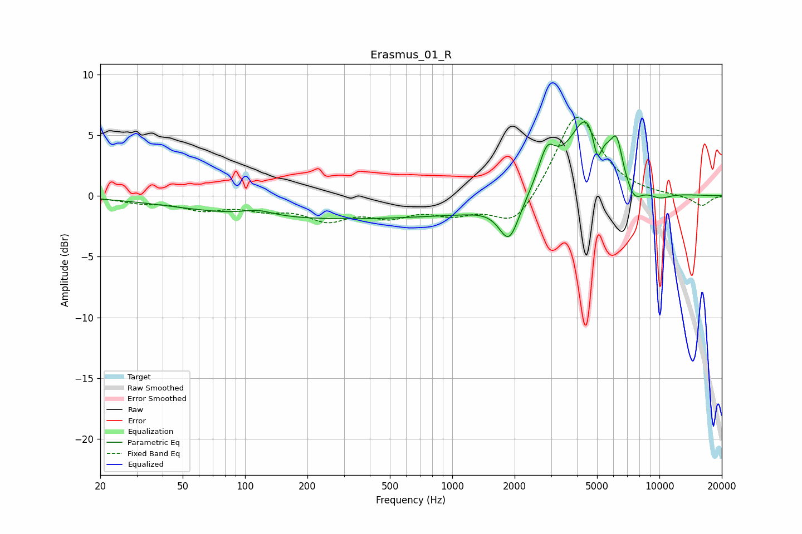

# Erasmus_01_R
See [usage instructions](https://github.com/jaakkopasanen/AutoEq#usage) for more options and info.

### Parametric EQs
Apply preamp of -6.2 dB when using parametric equalizer.

|   # | Type    |   Fc (Hz) |    Q |   Gain (dB) |
|-----|---------|-----------|------|-------------|
|   1 | Peaking |       115 | 1.89 |         0.5 |
|   2 | Peaking |       264 | 0.18 |        -1.9 |
|   3 | Peaking |      1223 | 0.95 |        -0.3 |
|   4 | Peaking |      1883 | 2.88 |        -3.4 |
|   5 | Peaking |      2866 | 3.44 |         2.9 |
|   6 | Peaking |      4590 | 1.46 |         7.1 |
|   7 | Peaking |      5016 | 6    |        -3.1 |
|   8 | Peaking |      6225 | 5.45 |         2.4 |
|   9 | Peaking |      7503 | 3.17 |        -1.8 |
|  10 | Peaking |     10000 | 2.2  |        -0.6 |

### Fixed Band EQs
When using fixed band (also called graphic) equalizer, apply preamp of **-6.6 dB** (if available) and set gains manually with these parameters.

|   # | Type    |   Fc (Hz) |    Q |   Gain (dB) |
|-----|---------|-----------|------|-------------|
|   1 | Peaking |        31 | 1.41 |        -0.5 |
|   2 | Peaking |        62 | 1.41 |        -1   |
|   3 | Peaking |       125 | 1.41 |        -0.9 |
|   4 | Peaking |       250 | 1.41 |        -1.7 |
|   5 | Peaking |       500 | 1.41 |        -1.4 |
|   6 | Peaking |      1000 | 1.41 |        -1.2 |
|   7 | Peaking |      2000 | 1.41 |        -2.7 |
|   8 | Peaking |      4000 | 1.41 |         7   |
|   9 | Peaking |      8000 | 1.41 |         0   |
|  10 | Peaking |     16000 | 1.41 |        -0.9 |

### Graphs

