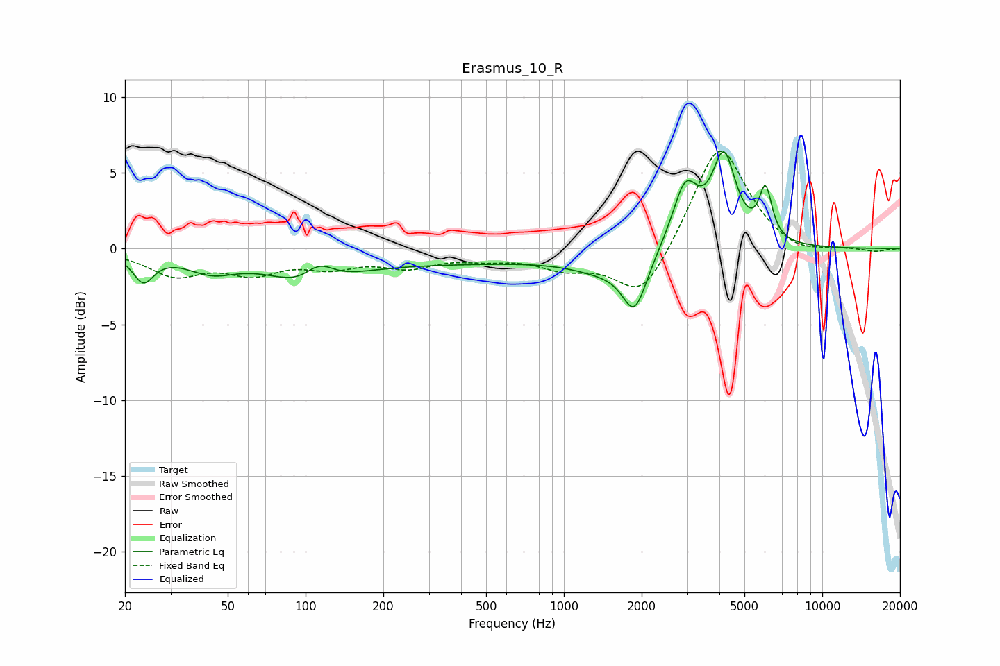

# Erasmus_10_R
See [usage instructions](https://github.com/jaakkopasanen/AutoEq#usage) for more options and info.

### Parametric EQs
Apply preamp of -6.5 dB when using parametric equalizer.

|   # | Type    |   Fc (Hz) |    Q |   Gain (dB) |
|-----|---------|-----------|------|-------------|
|   1 | Peaking |        24 | 3.57 |        -1.8 |
|   2 | Peaking |        43 | 1.44 |        -1.2 |
|   3 | Peaking |       105 | 1.11 |        -2.2 |
|   4 | Peaking |       113 | 2.22 |         1.8 |
|   5 | Peaking |       310 | 0.25 |        -0.9 |
|   6 | Peaking |      1414 | 1.12 |        -1   |
|   7 | Peaking |      1879 | 2.97 |        -3.5 |
|   8 | Peaking |      2950 | 2.8  |         4.1 |
|   9 | Peaking |      4164 | 3.04 |         5.7 |
|  10 | Peaking |      6036 | 5.64 |         3.3 |

### Fixed Band EQs
When using fixed band (also called graphic) equalizer, apply preamp of **-6.5 dB** (if available) and set gains manually with these parameters.

|   # | Type    |   Fc (Hz) |    Q |   Gain (dB) |
|-----|---------|-----------|------|-------------|
|   1 | Peaking |        31 | 1.41 |        -1.6 |
|   2 | Peaking |        62 | 1.41 |        -1.4 |
|   3 | Peaking |       125 | 1.41 |        -1   |
|   4 | Peaking |       250 | 1.41 |        -1   |
|   5 | Peaking |       500 | 1.41 |        -0.5 |
|   6 | Peaking |      1000 | 1.41 |        -1.1 |
|   7 | Peaking |      2000 | 1.41 |        -3.4 |
|   8 | Peaking |      4000 | 1.41 |         7.1 |
|   9 | Peaking |      8000 | 1.41 |        -0.6 |
|  10 | Peaking |     16000 | 1.41 |        -0.2 |

### Graphs

