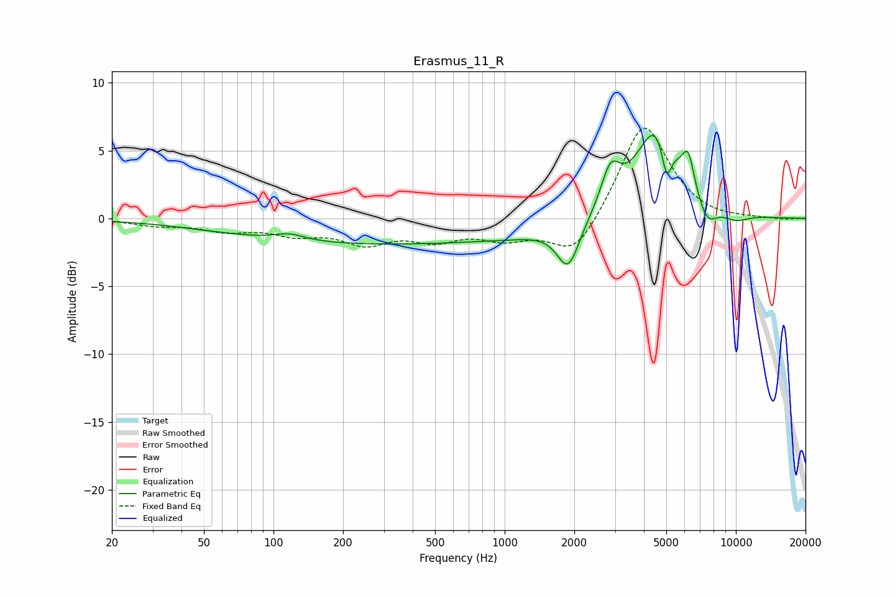

# Erasmus_11_R
See [usage instructions](https://github.com/jaakkopasanen/AutoEq#usage) for more options and info.

### Parametric EQs
Apply preamp of -6.2 dB when using parametric equalizer.

|   # | Type    |   Fc (Hz) |    Q |   Gain (dB) |
|-----|---------|-----------|------|-------------|
|   1 | Peaking |       117 | 2.06 |         0.5 |
|   2 | Peaking |       275 | 0.2  |        -1.9 |
|   3 | Peaking |      1201 | 0.89 |        -0.3 |
|   4 | Peaking |      1883 | 2.9  |        -3.4 |
|   5 | Peaking |      2870 | 3.44 |         2.9 |
|   6 | Peaking |      4595 | 1.5  |         7.1 |
|   7 | Peaking |      5014 | 6    |        -3.2 |
|   8 | Peaking |      6222 | 5.5  |         2.4 |
|   9 | Peaking |      7504 | 3.18 |        -1.7 |
|  10 | Peaking |     10000 | 2.2  |        -0.6 |

### Fixed Band EQs
When using fixed band (also called graphic) equalizer, apply preamp of **-6.8 dB** (if available) and set gains manually with these parameters.

|   # | Type    |   Fc (Hz) |    Q |   Gain (dB) |
|-----|---------|-----------|------|-------------|
|   1 | Peaking |        31 | 1.41 |        -0.4 |
|   2 | Peaking |        62 | 1.41 |        -0.8 |
|   3 | Peaking |       125 | 1.41 |        -1   |
|   4 | Peaking |       250 | 1.41 |        -1.6 |
|   5 | Peaking |       500 | 1.41 |        -1.3 |
|   6 | Peaking |      1000 | 1.41 |        -1.3 |
|   7 | Peaking |      2000 | 1.41 |        -2.9 |
|   8 | Peaking |      4000 | 1.41 |         7.2 |
|   9 | Peaking |      8000 | 1.41 |        -0.2 |
|  10 | Peaking |     16000 | 1.41 |        -0.1 |

### Graphs

