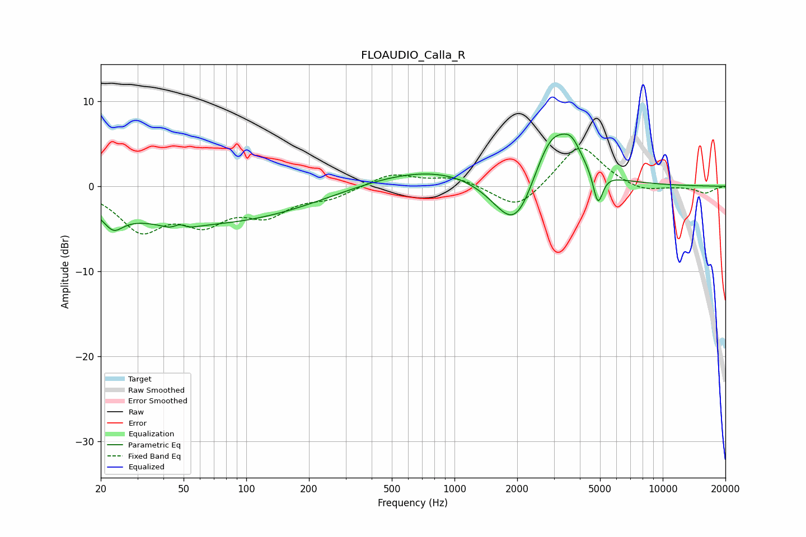

# FLOAUDIO_Calla_R
See [usage instructions](https://github.com/jaakkopasanen/AutoEq#usage) for more options and info.

### Parametric EQs
Apply preamp of -6.2 dB when using parametric equalizer.

|   # | Type    |   Fc (Hz) |    Q |   Gain (dB) |
|-----|---------|-----------|------|-------------|
|   1 | Peaking |        23 | 3.18 |        -2   |
|   2 | Peaking |        26 | 1.79 |        -0.2 |
|   3 | Peaking |        47 | 3.09 |        -3.7 |
|   4 | Peaking |        48 | 3.79 |         3.4 |
|   5 | Peaking |        64 | 0.27 |        -4.4 |
|   6 | Peaking |      1001 | 0.35 |         2.7 |
|   7 | Peaking |      1976 | 1.22 |        -8.8 |
|   8 | Peaking |      2914 | 1.36 |         7.8 |
|   9 | Peaking |      3654 | 3.15 |         2   |
|  10 | Peaking |      4886 | 6    |        -4   |

### Fixed Band EQs
When using fixed band (also called graphic) equalizer, apply preamp of **-4.6 dB** (if available) and set gains manually with these parameters.

|   # | Type    |   Fc (Hz) |    Q |   Gain (dB) |
|-----|---------|-----------|------|-------------|
|   1 | Peaking |        31 | 1.41 |        -4.8 |
|   2 | Peaking |        62 | 1.41 |        -3.6 |
|   3 | Peaking |       125 | 1.41 |        -2.9 |
|   4 | Peaking |       250 | 1.41 |        -1.2 |
|   5 | Peaking |       500 | 1.41 |         1.5 |
|   6 | Peaking |      1000 | 1.41 |         1.1 |
|   7 | Peaking |      2000 | 1.41 |        -2.9 |
|   8 | Peaking |      4000 | 1.41 |         5.1 |
|   9 | Peaking |      8000 | 1.41 |        -0.8 |
|  10 | Peaking |     16000 | 1.41 |        -0.8 |

### Graphs

